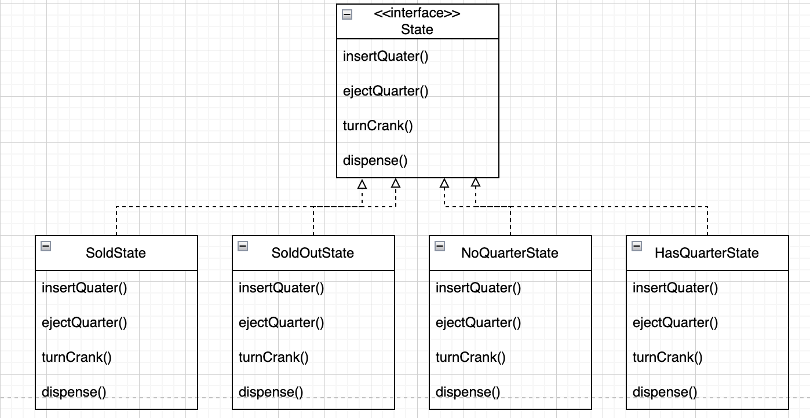
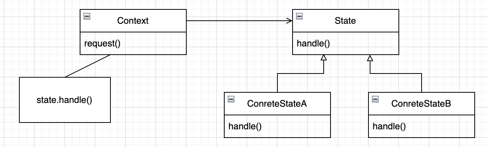

# Chapter10. 스테이트 패턴

## 학습목표

* 내부 상태를 바꿈으로써 객체에서 행동을 바꾸는 것을 도와주는 패턴

## 주식회사 왕뽑기

### 상태 다이어그램

<p align="center">

* 동그라미: 상태
* 화살표: 상태 전환

### 코드

```java
public class GumballMachine {
    private final static int SOLD_OUT = 0;
    private final static int NO_QUARTER = 1;
    private final static int HAS_QUARTER = 2;
    private final static int SOLD = 3;

    private int state = SOLD_OUT;
    private int count;

    public GumballMachine(final int count) {
        this.count = 5;

        if (count > 0) {
            state = NO_QUARTER;
        }
    }

    public void insertQuarter() {
        if (state == HAS_QUARTER) {
            System.out.println("동전은 한개만 넣어 주세요.");
        } else if (state == NO_QUARTER) {
            state = HAS_QUARTER;
            System.out.println("동전을 넣으셨습니다.");
        } else if (state == SOLD_OUT) {
            System.out.println("매진되었습니다. 다음 기회에 이용해 주세요.");
        } else if (state == SOLD) {
            System.out.println("잠깐만 기다려 주세요. 알맹이가 나가고 있습니다.");
        }
    }

    public void ejectQuarter() {
        if (state == HAS_QUARTER) {
            System.out.println("동전이 반환됩니다.");
            state = NO_QUARTER;
        } else if (state == NO_QUARTER) {
            System.out.println("동전을 넣어주세요.");
        } else if (state == SOLD) {
            System.out.println("이미 알맹이를 뽑으셨습니다.");
        } else if (state == SOLD_OUT) {
            System.out.println("동전을 넣지 않으셨습니다. 동전이 반환되지 않습니다.");
        }
    }

    public void turnCrank() {
        if (state == SOLD) {
            System.out.println("손잡이는 한번만 돌려주세요.");
        } else if (state == NO_QUARTER) {
            System.out.println("동전을 넣어주세요.");
        } else if (state == SOLD_OUT) {
            System.out.println("매진되었습니다.");
        } else if (state == HAS_QUARTER) {
            System.out.println("손잡이를 돌리셨습니다.");
            state = SOLD;
            dispense();
        }
    }

    public void dispense() {
        if (state == SOLD) {
            System.out.println("알맹이가 나가고 있습니다.");

            count -= 1;

            if (count == 0) {
                System.out.println("더 이상 알맹이가 없습니다.");
                state = SOLD_OUT;
            } else {
                state = NO_QUARTER;
            }
        } else if (state == NO_QUARTER) {
            state = HAS_QUARTER;
            System.out.println("동전을 넣으셨습니다.");
        } else if (state == SOLD_OUT) {
            System.out.println("매진입니다.");
        } else if (state == HAS_QUARTER) {
            System.out.println("알맹이가 나갈 수 없습니다.");
        }
    }

    @Override
    public String toString() {
        final StringBuilder stringBuilder = new StringBuilder();

        stringBuilder.append("\n주식화사 왕뽑기\n");
        stringBuilder.append("자바로 돌아가는 2004년형 뽑기 기계\n");
        stringBuilder.append("남은 개수:").append(count).append("개\n");

        if (state == SOLD_OUT) {
            stringBuilder.append("매진\n");
        } else {
            stringBuilder.append("동전 투입 대기 중\n");
        }

        return stringBuilder.toString();
    }
}
```

## 변경 요청 - 10분의 1확률로 알맹이가 2개 나옴

### 상태 다이어그램

<p align="center">

### 기존코드에 변경사항 추가

```java
public class GumballMachine {
    private final static int SOLD_OUT = 0;
    private final static int NO_QUARTER = 1;
    private final static int HAS_QUARTER = 2;
    private final static int SOLD = 3;
    // WINNER (당첨) 상태 추가 필요

    public void insertQuarter() {
        // 동전 투입시에 해야 할 일
    }

    public void ejectQuarter() {
        // 동전 반환시 해야 할 일
    }

    public void turnCrank() {
        // 손잡이를 돌렸을 때 해야 할 일
    }

    public void dispense() {
        // 알맹이 배출시에 해야 할 일
    }
}
```

* 문제점
    * OCP 를 지키지 않고 있다.
    * 포트란 스러운 코드??
    * 객체지향 디자인이 아님
    * 상태 전환이 조건문 속에 숨어 있어, 상태 전환시 결과가 분명하게 드러나지 않는다.
    * 바뀌는 부분이 캡슐화 되어 있지 않다.
    * 기능을 추가하면 버그 가능성 높다.
* 해결 방법
    * 각 상태의 행동을 별도의 클래스에 넣고, 각자의 상태에서 자기가 할일을 구현
    * 뽑기 기계는 상태 객체에게 작업을 넘김
* 해야할 일
    1. state 인터페이스 정의
    2. 모든 상태에 대해 상태 클래스 구현
    3. 조건문을 없애고, 상태 클래스에 모든 작업을 위임

### 새로운 디자인

<p align="center">

* State 인터페이스 구현

```java
public interface State {
    void insertQuarter();

    void ejectQuarter();

    void turnCrank();

    void dispense();
}
```

* 상태 클래스 구현

```java
public class NoQuarterState implements State {
    private final GumballMachine gumballMachine;

    public NoQuarterState(final GumballMachine gumballMachine) {
        this.gumballMachine = Objects.requireNonNull(gumballMachine);
    }

    @Override
    public void insertQuarter() {
        System.out.println("동전을 넣으셨습니다.");
        gumballMachine.setState(gumballMachine.getHasQuarterState());
    }

    @Override
    public void ejectQuarter() {
        System.out.println("동전으르 넣어주세요.");
    }

    @Override
    public void turnCrank() {
        System.out.println("동전으르 넣어주세요.");
    }

    @Override
    public void dispense() {
        System.out.println("동전으르 넣어주세요.");
    }
}
```

```java
public class HasQuarterState implements State {
    private final GumballMachine gumballMachine;

    public HasQuarterState(final GumballMachine gumballMachine) {
        this.gumballMachine = Objects.requireNonNull(gumballMachine);
    }

    @Override
    public void insertQuarter() {
        System.out.println("동전은 한 개만 넣어주세요.");
    }

    @Override
    public void ejectQuarter() {
        System.out.println("동전이 반환됩니다.");
        gumballMachine.setState(gumballMachine.getNoQuarterState());
    }

    @Override
    public void turnCrank() {
        System.out.println("손잡이를 돌리셨습니다.");
        gumballMachine.setState(gumballMachine.getSoldState());
    }

    @Override
    public void dispense() {
        System.out.println("알맹이가 나갈 수 없습니다.");
    }
}
```

```java
public class SoldState implements State {
    private final GumballMachine gumballMachine;

    public SoldState(final GumballMachine gumballMachine) {
        this.gumballMachine = Objects.requireNonNull(gumballMachine);
    }

    @Override
    public void insertQuarter() {
        System.out.println("잠깐만 기다려 주세요. 알맹이가 나가고 있습니다.");
    }

    @Override
    public void ejectQuarter() {
        System.out.println("이미 알맹이를 뽑으셨습니다.");
    }

    @Override
    public void turnCrank() {
        System.out.println("손잡이는 한번만 돌려주세요.");
    }

    @Override
    public void dispense() {
        gumballMachine.releaseBoll();

        if (gumballMachine.getCount() > 0) {
            gumballMachine.setState(gumballMachine.getNoQuarterState());
        } else {
            System.out.println("Oops, out of gumballs!");
            gumballMachine.setState(gumballMachine.getSoldOutState());
        }
    }
}
```

```java
public class SoldOutState implements State {
    private final GumballMachine gumballMachine;

    public SoldOutState(final GumballMachine gumballMachine) {
        this.gumballMachine = Objects.requireNonNull(gumballMachine);
    }

    @Override
    public void insertQuarter() {
        System.out.println("죄송합니다. 매진되었습니다.");
    }

    @Override
    public void ejectQuarter() {
        System.out.println("죄송합니다. 매진되었습니다.");
    }

    @Override
    public void turnCrank() {
        System.out.println("죄송합니다. 매진되었습니다.");
    }

    @Override
    public void dispense() {
        System.out.println("알맹이가 나갈 수 없습니다.");
    }
}
```

* GumballMachine

```java
public class GumballMachine {
    private final NoQuarterState noQuarterState;
    private final HasQuarterState hasQuarterState;
    private final SoldState soldState;
    private final SoldOutState soldOutState;

    private State state;
    private int count = 0;

    public GumballMachine(final int count) {
        noQuarterState = new NoQuarterState(this);
        hasQuarterState = new HasQuarterState(this);
        soldState = new SoldState(this);
        soldOutState = new SoldOutState(this);

        this.count = count;

        if (count > 0) {
            state = noQuarterState;
        } else {
            state = soldOutState;
        }
    }

    public void insertQuarter() {
        state.insertQuarter();
    }

    public void ejectQuarter() {
        state.ejectQuarter();
    }

    public void turnCrank() {
        state.turnCrank();
        state.dispense();
    }

    void setState(final State state) {
        this.state = state;
    }

    void releaseBoll() {
        System.out.println("A gumball comes rolling out the slot...");
        if (count != 0) {
            count -= 1;
        }
    }

    public NoQuarterState getNoQuarterState() {
        return noQuarterState;
    }

    public HasQuarterState getHasQuarterState() {
        return hasQuarterState;
    }

    public SoldState getSoldState() {
        return soldState;
    }

    public SoldOutState getSoldOutState() {
        return soldOutState;
    }

    public int getCount() {
        return count;
    }
}
```

* 지금까지 한 일
    * 각 상태의 행동을 별개의 클래스로 국지화
    * if문 삭제
    * 각 상태의 변경에 대해서는 닫혀 있도록 하면서도, 새로운 상태 클래스를 추가하는 확장에 대해서는 열려 있다.
        * OCP

## 스테이터 패턴

> 객체 내부 상태가 바뀜에 따라서 객체의 행동을 바꿀 수 있다.
> 마치 객체의 클래스가 바뀌는 것과 같은 결과를 얻을 수 있다.

### 클래스 다이어그램

<p align="center">

* 스트레티지 패턴과 다이어그램이 같지만 용도의 차이가 있음
* 스테이트 패턴: 상태 객체에 일련의 행동이 캡슐화
    * Context 에서 여러 상태 객체 중 한 객체에게 모든 행동을 맡기게 됨
    * 컨텍스트 객체에 조건문을 집어넣는 대신에 사용할 수 있는 패턴
* 스트레티지 패턴: 클라이언트에서 컨텍스트 객체에게 어떤 전략 객체를 사용할지 지정해 줌
    * 실행시에 전략 객체를 변경할 수 있는 유연성을 제공하기 위한 용도

### 질문

* 반드시 구상 상태 클래스에서 다음 상태를 결정해야 하는가?
    * 상태전환이 고정되어 있으면 Context 에서 결정하도록 해도 된다.
    * 하지만 상태전환이 동적으로 되는 경우, 상태 클래스 내에서 처리하는 것이 좋음
        * 상태 클래스 내에서 상태 전환을 하면, 상태 클래스들 사이에 의존성이 생긴다는 단점이 있따.
* 클라이언트에서 상태 객체하고 직접 연락하는 경우도 있나?
    * 없다.
    * 상태는 Context 쪽에서 내부 상태 및 행동을 표현하기 위한 용도로 사용하는 것
* 애플리케이션에 Context 의 인스턴스가 많은데, 여러 Context 에서 상태를 공유할 수 있나?
    * 된다. 그런 경우가 흔히 있다.
    * 단, 상태 객체를 공유하려면 상태 객체 안에 자체 상태가 없어야 한다.

## 공짜 알맹이 당첨 기능 추가

### GumballMachine 추가

```java
public class GumballMachine {
    // ...
    private final WinnerState winnerState;

    // ...
    public WinnerState getWinnerState() {
        return winnerState;
    }
}
```

### WinnerState 생성

```java
public class WinnerState implements State {
    private final GumballMachine gumballMachine;

    public WinnerState(final GumballMachine gumballMachine) {
        this.gumballMachine = Objects.requireNonNull(gumballMachine);
    }

    @Override
    public void insertQuarter() {
        System.out.println("잠깐만 기다려 주세요. 알맹이가 나가고 있습니다.");
    }

    @Override
    public void ejectQuarter() {
        System.out.println("이미 알맹이를 뽑으셨습니다.");
    }

    @Override
    public void turnCrank() {
        System.out.println("손잡이는 한번만 돌려주세요.");
    }

    @Override
    public void dispense() {
        System.out.println("축하합니다! 알맹이를 하나 더 받으실 수 있습니다.");
        gumballMachine.releaseBoll();

        if (gumballMachine.getCount() > 0) {
            gumballMachine.releaseBoll();

            if (gumballMachine.getCount() > 0) {
                gumballMachine.setState(gumballMachine.getNoQuarterState());
            } else {
                System.out.println("더 이상 알맹이가 없습니다.");
                gumballMachine.setState(gumballMachine.getSoldOutState());
            }
        } else {
            System.out.println("더 이상 알맹이가 없습니다.");
            gumballMachine.setState(gumballMachine.getSoldOutState());
        }
    }

    @Override
    public String toString() {
        return "당첨";
    }
}
```

* SoldState 에서 알맹이를 두개 내보내도록 하면 안되나?
    * 한 상태 클래스에서 두 가지 상태를 표현하게 됨 -> 단일 역할 원칙에 위배

### HasQuarterState 변경

```java
public class HasQuarterState implements State {
    // ...
    private final Random randomWinner;

    // ...
    @Override
    public void turnCrank() {
        System.out.println("손잡이를 돌리셨습니다.");

        final var winner = randomWinner.nextInt(10);

        if (winner == 0 && gumballMachine.getCount() > 1) {
            gumballMachine.setState(gumballMachine.getWinnerState());
        } else {
            gumballMachine.setState(gumballMachine.getSoldState());
        }
    }
}
```

## refill() 메서드 추가

### State 인터페이스

```java
public interface State {
    // refill
    void refill(int count);
}
```

### 상태 객체

```java
public class SoldOutState implements State {
    // ...
    @Override
    public void refill(final int count) {
        gumballMachine.setCount(count);
        gumballMachine.setState(gumballMachine.getNoQuarterState());
    }
}
```

## 기타

* 바꿔 쓸 수 있는 행동을 캡슐화 한 다음, 실제 행동은 다른 객체에 위임 - 스트래티지 패턴
* 알고리즘의 각 단계를 구현하는 방법을 서브클래스에 위임 - 템풀릿 메소드 패턴
* 상태를 기반으로 하는 행동을 캡슐화 하고 행동을 현재 상태한테 위임 - 템플릿 멧도 패턴

## 핵심정리

* 스테이트 패턴을 이용하면,
    * 내부 상태를 바탕으로 여러 가지 서로 다른 행동을 사용할 수 있음
    * 각 상태를 클래스를 이용하여 표현하게 됨
    * Context 객체에서는 형재 상태에게 행동을 위임
    * 각 상태를 클래스로 캡슐화 함으로써 나중에 변경시켜야 하는 내용을 국지화
* 스테이트 패턴과 스트래티지 패턴의 클래스 다이어그램은 같지만 용도는 다르다.
    * 스트레티지 패턴: 일반적으로 행동 또는 알고리즘을 Context 클래스를 만들 때 설정한다.
    * 스테이트 패턴: Context의 내부 상태가 바뀜에 따라 알아서 행동을 바꿀 수 있다.
* 스테이트 패턴의 특징
    * 상태전환은 State 클래스에 의해 제어할 수도 있고, Context 클래스에서 제어할 수도 있다.
    * 스테이트 패턴을 이용하면 보통 디자인에 필요한 클래스의 개수가 늘어난다.
    * State 클래스를 여러 Context 객체의 인스턴스에서 공유하도록 디자인 할 수 있다.

  


