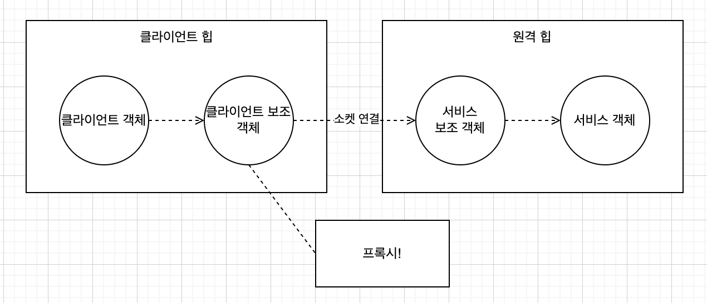

# Chapter11. 프록시 패턴

## 학습목표

* 프록시가 하는 일
    * **자신이 대변하는 객체**와 그 객체에 접근하고자 하는 **클라이언트** 사이에서 여러 가지 방식으로 작업을 처리
    * 자신이 대변하는 객체에 대해서 인터넷을 통해 들어오는 메소드 호출을 쫓아냄
    * 게으른 객체들을 대신에서 끈기 있게 기다림

## 뽑기 기계 모니터링

### 코드

```java
public class GumballMachine {

    // ...
    private final String location;
    private int count;

    public GumballMachine(final String location, final int count) {
        // ...
        this.location = location;
        this.count = count;
    }

    // ...
    public String getLocation() {
        return location;
    }

    public int getCount() {
        return count;
    }
}
```

```java
public class GumballMonitor {
    private final GumballMachine gumballMachine;

    public GumballMonitor(final GumballMachine gumballMachine) {
        this.gumballMachine = Objects.requireNonNull(gumballMachine);
    }

    public void report() {
        System.out.println("뽑기 기계 위치: " + gumballMachine.getLocation());
        System.out.println("뽑기 기계 위치: " + gumballMachine.getCount() + " 개");
        System.out.println("뽑기 기계 위치: " + gumballMachine.getState());
    }
}
```

### 테스트

```java
public class GumballMachineTestDrive {
    public static void main(String[] args) {
        if (args.length < 2) {
            System.out.println("GumballMachine <name> <inventory>");
            System.out.println(1);
        }

        final var name = args[0];
        final var count = Integer.parseInt(args[1]);
        final var gumballMachine = new GumballMachine(name, count);
        final var monitor = new GumballMonitor(gumballMachine);

        monitor.report();
    }
}
```

```shell
$ java GumballMachineTestDrive Seattle 112
```

```text
뽑기 기계 위치: Seattle
뽑기 기계 위치: 112 개
뽑기 기계 위치: 동전 투입 대기중
```

## 요구사항: 원격으로 모니터링

* 모니터링 코드는 그대로 두고, 원격 객체에 대한 프록시만 넘겨준다.
* 프록시의 역할
    * 진짜 객체(여기서는 GumballMachine)를 대신하는 역할
    * 코드는 그대로 두고 모니터링용 클래스에 GumballMachine 에 대한 레퍼런스만 넘긴다. 그 프록시는 진짜 객체인 것 처럼 행동하지만 실제로는 네트워크를 통해서 진짜 객체하고 객체를 주고 받음

### 원격 프록시의 역할

<p align="center">

* 원격 객체에 대한 로컬 대변자 역할
* 원격 객체: 다른 자바 가상 머신의 힙에서 살고 있는 객체(다른 주소 공간에서 돌아가고 있는 원격 객체)
* 로컬 대변자: 로컬 대변자의 어떤 메소드를 호출하면, 다른 원격 객체한테 그 메소드 호출을 전달해 주는 역할을 맡고 있는 객체

## 원격 프록시

### RMI(Remote Method Invocation) 기초

<p align="center">

#### 하는 일

* 원격 JVM에 있는 객체를 찾아서 메서드 호출
* 클라이언트와 서비스 보조 객체를 만들어 줌
* 네트워킹 및 입출력 관련 코드를 직접 작성하지 않아도 됨
* 룩업 서비스(클라이언트에서 원격 객체를 찾아서 그 원격객체에 접근하기 위해 쓸 수 있는 서비스) 제공

#### 용어

* 스터브: 클라이언트 보조 객체
* 스켈레톤: 서비스 보조 객체

#### 구현

1. 원격 인터페이스 만들기

```java
public interface MyRemote extends Remote {
    String sayHello(String name) throws RemoteException;
}
```

2. 서비스 구현 클래스 만들기

```java
public class MyRemoteImpl extends UnicastRemoteObject implements MyRemote {
    protected MyRemoteImpl() throws RemoteException {
    }

    @Override
    public String sayHello(String name) throws RemoteException {
        return "Server say, 'Hey, " + name + "'!";
    }

    public static void main(String[] args) {
        try {
            final var service = new MyRemoteImpl();
            LocateRegistry.createRegistry(1099);
            Naming.rebind("RemoteHello", service);
            System.out.println("Service started...");
        } catch (Exception e) {
            e.printStackTrace();
        }
    }
}
```

3. 클라이언트 코드
    * Java 9 이상에서 기본적인 RMI를 설정하는 경우, 다음과 같이 스텁 없이 서버를 설정할 수 있음

```java
public class MyRemoteClient {
    public static void main(String[] args) {
        new MyRemoteClient().go();
    }

    public void go() {
        try {
            final var service = (MyRemote) Naming.lookup("rmi://127.0.0.1/RemoteHello");
            final var s = service.sayHello("Tiffany");

            System.out.println(s);
        } catch (Exception e) {
            e.printStackTrace();
        }
    }
}
```

### GumballMachine 을 원격 서비스로

#### 원격

```java
public interface GumballMachineRemote extends Remote {
    int getCount() throws RemoteException;

    String getLocation() throws RemoteException;

    // 모든 리턴 형식은 Serializable 이어야 한다.
    // 지원 해야 하는 메소드 모두 RemoteException 을 던질 수 있따.
    State getState() throws RemoteException;
}
```

```java
public interface State extends Serializable {
    void insertQuarter();

    void ejectQuarter();

    void turnCrank();

    void dispense();

    void refill(int count);
}
```

```java
public class GumballMachine extends UnicastRemoteObject implements GumballMachineRemote {
    // ...

    public GumballMachine(final String location, final int count) throws RemoteException {
        // ...
    }

    // ...
}
```

#### RMI 레지스트리 등록

* 실행할 때 vm option 추가 필요
    * -Djava.rmi.server.hostname=seattle.mightygumball.com
* 실행할 때 args
    * seattle.mighty.com 250
* /etc/hosts 파일에 추가 해 줘야 함
    * 127.0.0.1 seattle.mightygumball.com

```java
public class GumballMachineTestDrive {
    public static void main(String[] args) {
        if (args.length < 2) {
            System.out.println("GumballMachine <name> <inventory>");
            System.exit(1);
        }

        try {
            final var name = args[0];
            final var count = Integer.parseInt(args[1]);
            final GumballMachine gumballMachine = new GumballMachine(name, count);

            LocateRegistry.createRegistry(1099);
            Naming.rebind(name + "/gumballmachine", gumballMachine);
        } catch (Exception e) {
            throw new RuntimeException(e);
        }
    }
}
```

#### 클라이언트

```java
public class GumballMonitor {
    private final GumballMachineRemote gumballMachine;

    public GumballMonitor(final GumballMachineRemote gumballMachine) {
        this.gumballMachine = Objects.requireNonNull(gumballMachine);
    }

    public void report() {
        try {
            System.out.println("뽑기 기계 위치: " + gumballMachine.getLocation());
            System.out.println("뽑기 기계 위치: " + gumballMachine.getCount() + " 개");
            System.out.println("뽑기 기계 위치: " + gumballMachine.getState());
        } catch (RemoteException e) {
            throw new RuntimeException(e);
        }
    }
}
```

```java
public class GumballMonitorTestDrive {
    public static void main(String[] args) {
        final String[] locations = {
                "rmi://seattle.mightygumball.com/gumballmachine"
        };
        final GumballMonitor[] monitors = new GumballMonitor[locations.length];
        for (int i = 0; i < locations.length; i++) {
            try {
                final var machine = (GumballMachineRemote) Naming.lookup(locations[i]);
                monitors[i] = new GumballMonitor(machine);
                System.out.println(monitors[i]);
            } catch (Exception e) {
                e.printStackTrace();
            }
        }

        for (int i = 0; i < monitors.length; i++) {
            monitors[i].report();
        }
    }
}
```

## 프록시 패턴

> 어떤 객체에 대한 접근을 제어하기 위한 용도로 대리인이나 대변인에 해당하는 개체를 제공하는 패턴

### 프록시 종류

* 원격 프록시: 원격 객체에 대한 접근을 제어
* 가상 프록시: 생성하기 힘든 자원에 대한 접근을 제어
* 보호 프록시: 접근 권한이 필요한 자원에 대한 접근 제어

### 클래스 다이어그램

<p align="center">

* Subject: 클라이언트에서 Proxy와 RealSubject를 똑같은 방식으로 다룰 수 있게 하기 위한 인터페이스
* RealSubject: 실제 작업을 대부분 처리하는 객체
* Proxy
    * 실제작업을 처리하는 객체에 대한 레퍼런스(RealSubject)가 있음
    * RealSubject의 인스턴스를 생성하거나, 생성과정에 관여

## 가상 프록시

* 생성하는데 많은 비용이 드는 개체를 대신 생성하는 역할
* 실제로 진짜 객체가 필요하게 되기 전까지 객체의 생성을 미루게 해 주는 기능
* 객체 생성 전, 객체 생성 중에 객체를 대신함
* 객체 생성이 완료되면 RealSubject 에 요청을 전달해 줌

### 구현

```java
class ImageProxy implements Icon {
    volatile ImageIcon imageIcon;
    final URL imageURL;
    Thread retrievalThread;
    boolean retrieving = false;

    public ImageProxy(URL url) {
        imageURL = url;
    }

    public int getIconWidth() {
        if (imageIcon != null) {
            return imageIcon.getIconWidth();
        } else {
            return 800;
        }
    }

    public int getIconHeight() {
        if (imageIcon != null) {
            return imageIcon.getIconHeight();
        } else {
            return 600;
        }
    }

    synchronized void setImageIcon(ImageIcon imageIcon) {
        this.imageIcon = imageIcon;
    }

    public void paintIcon(final Component c, Graphics g, int x, int y) {
        if (imageIcon != null) {
            imageIcon.paintIcon(c, g, x, y);
        } else {
            g.drawString("Loading album cover, please wait...", x + 300, y + 190);
            if (!retrieving) {
                retrieving = true;

                retrievalThread = new Thread(new Runnable() {
                    public void run() {
                        try {
                            setImageIcon(new ImageIcon(imageURL, "Album Cover"));
                            c.repaint();
                        } catch (Exception e) {
                            e.printStackTrace();
                        }
                    }
                });

                retrievalThread = new Thread(() -> {
                    try {
                        setImageIcon(new ImageIcon(imageURL, "Album Cover"));
                        c.repaint();
                    } catch (Exception e) {
                        e.printStackTrace();
                    }
                });
                retrievalThread.start();

            }
        }
    }
}
```

```java
public class ImageProxyTestDrive {
    ImageComponent imageComponent;
    JFrame frame = new JFrame("Album Cover Viewer");
    JMenuBar menuBar;
    JMenu menu;
    Hashtable<String, String> albums = new Hashtable<>();

    public static void main(String[] args) throws Exception {
        ImageProxyTestDrive testDrive = new ImageProxyTestDrive();
    }

    public ImageProxyTestDrive() throws Exception {
        albums.put("Buddha Bar", "http://images.amazon.com/images/P/B00009XBYK.01.LZZZZZZZ.jpg");
        albums.put("Ima", "http://images.amazon.com/images/P/B000005IRM.01.LZZZZZZZ.jpg");
        albums.put("Karma", "http://images.amazon.com/images/P/B000005DCB.01.LZZZZZZZ.gif");
        albums.put("MCMXC a.D.", "http://images.amazon.com/images/P/B000002URV.01.LZZZZZZZ.jpg");
        albums.put("Northern Exposure", "http://images.amazon.com/images/P/B000003SFN.01.LZZZZZZZ.jpg");
        albums.put("Selected Ambient Works, Vol. 2", "http://images.amazon.com/images/P/B000002MNZ.01.LZZZZZZZ.jpg");

        URL initialURL = new URL((String) albums.get("Selected Ambient Works, Vol. 2"));
        menuBar = new JMenuBar();
        menu = new JMenu("Favorite Albums");
        menuBar.add(menu);
        frame.setJMenuBar(menuBar);

        for (Enumeration<String> e = albums.keys(); e.hasMoreElements(); ) {
            String name = (String) e.nextElement();
            JMenuItem menuItem = new JMenuItem(name);
            menu.add(menuItem);
            menuItem.addActionListener(event -> {
                imageComponent.setIcon(new ImageProxy(getAlbumUrl(event.getActionCommand())));
                frame.repaint();
            });
        }

        // set up frame and menus
        Icon icon = new ImageProxy(initialURL);
        imageComponent = new ImageComponent(icon);
        frame.getContentPane().add(imageComponent);
        frame.setDefaultCloseOperation(JFrame.EXIT_ON_CLOSE);
        frame.setSize(800, 600);
        frame.setVisible(true);

    }

    URL getAlbumUrl(String name) {
        try {
            return new URL(albums.get(name));
        } catch (MalformedURLException e) {
            e.printStackTrace();
            return null;
        }
    }
}
```

```java
class ImageComponent extends JComponent {
    @Serial
    private static final long serialVersionUID = 1L;
    private Icon icon;

    public ImageComponent(Icon icon) {
        this.icon = icon;
    }

    public void setIcon(Icon icon) {
        this.icon = icon;
    }

    public void paintComponent(Graphics g) {
        super.paintComponent(g);
        int w = icon.getIconWidth();
        int h = icon.getIconHeight();
        int x = (800 - w) / 2;
        int y = (600 - h) / 2;
        icon.paintIcon(this, g, x, y);
    }
}
```

## 보호 프록시

* 자바 프록시 기능 내장
    * java.lang.reflect
    * 실제 프록시는 실행 중에 생성되기 때문에, 동적 프록시라고 부름
* 클래스 다이어그램
    * 프록시: Proxy, InvocationHandler 두개의 클래스
        * Proxy 는 자바가 만들어 주기 때문에, Proxy 에게 무슨 일을 할지 알려주기 위한 방법으로 InvocationHandler 를 사용 한다.

<p align="center">

### 결혼 정보 서비스 테스트 - 보호 프록시

```java
public interface PersonBean {
    String getName();

    String getGender();

    String getInterests();

    int getHotOrNotRating();

    void setName(String name);

    void setGender(String gender);

    void setInterests(String interests);

    void setHotOrNotRating(int rating);
}
```

```java
public class PersonBeanImpl implements PersonBean {
    private String name;
    private String gender;
    private String interests;
    private int rating;
    private int ratingCount = 0;

    @Override
    public String getName() {
        return name;
    }

    @Override
    public String getGender() {
        return gender;
    }

    @Override
    public String getInterests() {
        return interests;
    }

    @Override
    public int getHotOrNotRating() {
        if (ratingCount == 0) {
            return 0;
        }
        return rating / ratingCount;
    }

    @Override
    public void setName(String name) {
        this.name = name;
    }

    @Override
    public void setGender(String gender) {
        this.gender = gender;
    }

    @Override
    public void setInterests(String interests) {
        this.interests = interests;
    }

    @Override
    public void setHotOrNotRating(int rating) {
        this.rating += rating;
        this.ratingCount += 1;
    }
}
```

```java
public class OwnerInvocationHandler implements InvocationHandler {
    private final PersonBean person;

    public OwnerInvocationHandler(final PersonBean person) {
        this.person = Objects.requireNonNull(person);
    }

    @Override
    public Object invoke(Object proxy, Method method, Object[] args) throws IllegalAccessException {
        try {
            if (method.getName().startsWith("get")) {
                return method.invoke(person, args);
            } else if (method.getName().equals("setHotOrHotRating")) {
                throw new IllegalAccessException();
            } else if (method.getName().startsWith("set")) {
                return method.invoke(person, args);
            }
        } catch (InvocationTargetException e) {
            e.printStackTrace();
        }

        return null;
    }
}
```

```java
public class NonOwnerInvocationHandler implements InvocationHandler {
    private final PersonBean person;

    public NonOwnerInvocationHandler(final PersonBean person) {
        this.person = Objects.requireNonNull(person);
    }

    @Override
    public Object invoke(Object proxy, Method method, Object[] args) throws IllegalAccessException {
        try {
            if (method.getName().startsWith("get")) {
                return method.invoke(person, args);
            } else if (method.getName().equals("setHotOrNotRating")) {
                return method.invoke(person, args);
            } else if (method.getName().startsWith("set")) {
                throw new IllegalAccessException();
            }
        } catch (InvocationTargetException e) {
            e.printStackTrace();
        }

        return null;
    }
}
```

```java
public class MatchMakingTestDrive {
    HashMap<String, PersonBean> datingDB = new HashMap<>();

    public static void main(String[] args) {
        MatchMakingTestDrive test = new MatchMakingTestDrive();
        test.drive();
    }

    public MatchMakingTestDrive() {
        initializeDatabase();
    }

    public void drive() {
        PersonBean joe = getPersonFromDatabase("Joe Javabean");
        PersonBean ownerProxy = getOwnerProxy(joe);
        System.out.println("Name is " + ownerProxy.getName());
        ownerProxy.setInterests("bowling, Go");
        System.out.println("Interests set from owner proxy");
        try {
            ownerProxy.setHotOrNotRating(10);
        } catch (Exception e) {
            System.out.println("Can't set rating from owner proxy");
        }
        System.out.println("Rating is " + ownerProxy.getHotOrNotRating());

        PersonBean nonOwnerProxy = getNonOwnerProxy(joe);
        System.out.println("Name is " + nonOwnerProxy.getName());
        try {
            nonOwnerProxy.setInterests("bowling, Go");
        } catch (Exception e) {
            System.out.println("Can't set interests from non owner proxy");
        }
        nonOwnerProxy.setHotOrNotRating(3);
        System.out.println("Rating set from non owner proxy");
        System.out.println("Rating is " + nonOwnerProxy.getHotOrNotRating());
    }

    PersonBean getOwnerProxy(PersonBean person) {
        return (PersonBean) Proxy.newProxyInstance(
                person.getClass().getClassLoader(),
                person.getClass().getInterfaces(),
                new OwnerInvocationHandler(person));
    }

    PersonBean getNonOwnerProxy(PersonBean person) {
        return (PersonBean) Proxy.newProxyInstance(
                person.getClass().getClassLoader(),
                person.getClass().getInterfaces(),
                new NonOwnerInvocationHandler(person));
    }

    PersonBean getPersonFromDatabase(String name) {
        return datingDB.get(name);
    }

    void initializeDatabase() {
        PersonBean joe = new PersonBeanImpl();
        joe.setName("Joe Javabean");
        joe.setInterests("cars, computers, music");
        joe.setHotOrNotRating(7);
        datingDB.put(joe.getName(), joe);

        PersonBean kelly = new PersonBeanImpl();
        kelly.setName("Kelly Klosure");
        kelly.setInterests("ebay, movies, music");
        kelly.setHotOrNotRating(6);
        datingDB.put(kelly.getName(), kelly);
    }
}
```

## 기타 프록시

### 방화벽 프록시

* 일련의 네트워크 자원에 대한 접근을 제어
* 주 객체를 "나쁜" 클라이언트들로 부터 보호

### 스마트 레퍼런스 프록시

* 주 객체가 참조될 떄마다 추가 행동을 제공 ex) 객체에 대한 레퍼런스 개수를 세는 행동

### 캐싱 프록시

* 비용이 많이 드는 작업의 결과를 임시로 저장
* 여러 클라이언트에서 결과를 공유함으로써 계산 시간 또는 네트워크 지연을 줄여줌

### 동기화 프록시

* 여러 스레드에서 주 객체에 접근하는 경우, 안전하게 작업을 처리할 수 있게 해 줌

### 복잡도 숨김 프록시

* 복잡한 클래스의 집합에 대한 접근을 제어하고 복잡도를 숨겨 둠
* 퍼사드 프록시라고 부르기도 함
* 퍼사드 패턴과의 차이점
    * 접근을 제어 하는 기능도 함

### 지연 복사 프록시

* 클라이언트에서 필요로할 때까지 객체가 복사되는 것을 지연시킴으로써 객체의 복사를 제어
* 변형된 가상 프록시

## 핵심정리

* 프록시 패턴을 이용하면
    * 어떤 객체에 대한 대변인을 내세워서 클라이언트의 접근을 제어할 수 있다.
    * 접근을 관리하는 방법에는 여러가지가 있다.
* 원격 프록시
    * 클라이언트와 원격 객체 사이의 데이터 전달을 관리
* 가상 프록시
    * 인스턴스를 만드는 데 많은 비용이 드는 객체에 대한 접근을 제어
* 보호 프록시
    * 호출하는 쪽의 권한에 따라서 객체에 있는 메소드에 대한 접근을 제오
* 그 외.. 캐싱 프록시, 동기화 프록시, 방화벽 프로시, 지연 복사 프록시 ...
* 프록시 패턴은 데코레이터 패턴의 구조아 비슷하지만 용도가 다르다.
    * 데코레이터 패턴: 객체에 행동을 추가
    * 프록시 패턴: 접근을 제어

