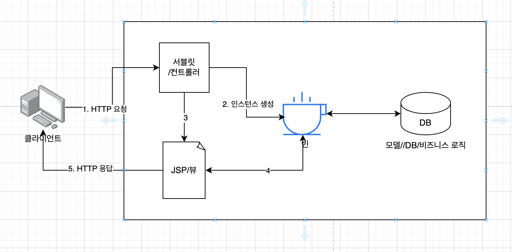

# 컴파운드 패턴

## 컴파운트 패턴이란

* 하나의 디자인 문제를 해결하기 위해 여러 패턴을 함께 사용하는 패턴
* 반복적으로 생길 수 있는 일반적인 문제를 해결하기 위한 용도로 두개 이상의 패턴을 결합해서 사용
* 모델 - 뷰 - 컨트롤러

## MVC 코드

* 코드를 기능에 따라 나눠주는 패러다임
* 모델 - 컨트롤러 - 뷰
* 모델 객체
    * 애플리케이션의 문제 해결을 위한 클래스
    * 모든 데이터, 상태 및 에플리케이션 로직이 들어 있음
    * 뷰와 컨트롤러에서 모델의 상태를 조작하거나 가져오기 위한 인터페이스를 제공
    * 옵저버들한테 변화에 대해 알려주긴 하지만, 기본적으로 뷰 및 컨트롤러에 관심이 없음
    * 어떤 뷰에서도 재사용할 수 있음
* 뷰 객체
    * 모델을 표현하는 방법을 제공
    * 화면에 표시하기 위해 필요한 상태 및 데이터를 모델에서 직접 가져 옴
    * 뷰는 모들에 대해서 모름 (느슨한 연결 -> 재사용성 높임)
* 컨트롤러
    * 사용자로부터 입력을 받아서, 그것이 모델에게 어떤 의미가 있는지 파악
    * 뷰와 모델 사이의 중개자

### MVC 에서 사용하는 패턴

1. 뷰 - 컨트롤러, 스트래티지 패턴
    * 컨트롤러가 행동을 제공, 다른 행동을 원한다면 다른 컨트롤러로 교환하면 됨
    * 뷰를 모델로 부터 분리시키는데 도움이 됨
2. 모델, 옵저버 패턴
    * 상태가 변경되었을 때, 모델하고 연관된 객체들한테 연락
3. 뷰, 컴포지트 패턴
    * 디스클레이는 여러 단계로 겹쳐져 있을 수 있는 일련의 윈도우, 패널, 버튼, 텍스트 레이블 등으로 구성된다. 각 디스플레이항목은 복합 객체(윈도우) 또는 잎(버튼)이 될 수 있다.
    * 컨트롤러에서 뷰한테 화면을 객신해 달라고 여청하면, 최상위 뷰 구성요소한테만 화면을 갱신하라고 얘기하면 됨
    * 나머지는 컴포지트 패턴에 의해 자동으로 처리

### DJ

### Heart

## 모델2

1. 사용자가 HTTP를 춍청하면 서블릿에서 요청을 수신
    * 사용자 ID, 비밀번호와 같은 폼데이터가 함께 전달 되고
    * 서블릿에서는 이를 받아서 파싱
2. 서블릿이 컨트롤러의 역할을 수행
    * 컨트롤러 역할을 맡아서 사용자 요청을 처리
    * 대부분의 경우에 모델(데이터베이스)에 요청을 하게 됨
    * 요청을 처리한 결과는 자바빈으로 포장 됨
3. 컨트롤러에서는 컨트롤을 뷰한테 넘김
    * 뷰는 JSP에서 표현
    * JSP에서는 (4.자바빈을 통해서 얻은)모델의 뷰를 만들어 주면 됨
5. 뷰에서 HTTP를 통해 브라우저 한테 페이지 전달

## 컴파운드 패턴

* 두 개 이상의 패턴을 결합하여 일반적으로 자주 등장하는 문제들에 대한 해법을 제공

## 핵심 정리

* MVC는 옵저버 패턴, 스트래티지 패턴, 컴포지트 패턴으로 이루어진 컴파운드 패턴이다.
    * 모델: 옵저버 패턴을 이용하여, 옵저버들에 대한 의존성을 없애면서도 옵저버들한테 자신의 상태가 변경되었음을 알린다.
    * 컨트롤러: 뷰에 대한 전략 객체, 뷰에서 컨트롤러를 바꾸면 다른 행동을 활용할 수 있음
    * 뷰에서는 컴포지트 패턴을 이용하여 사용자 인터페이스를 구현
    * 이 패턴들을 사용하여 서로 느슨한 연결
* 모델2: MVC를 웹에 맞게 적용한 디자인
    * 컨트롤러는 서블릿으로 구현되며
    * 뷰는 JSP/HTML로 구현됨