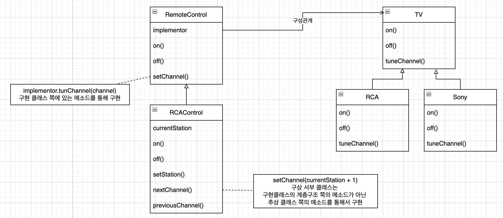
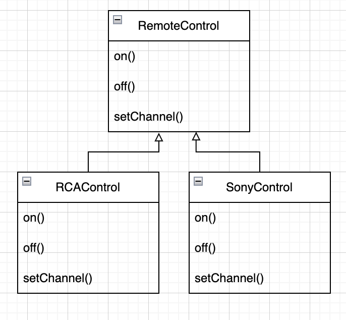
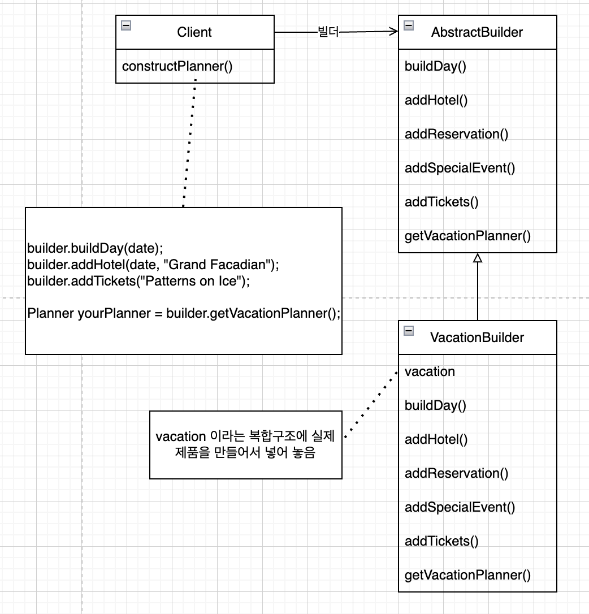
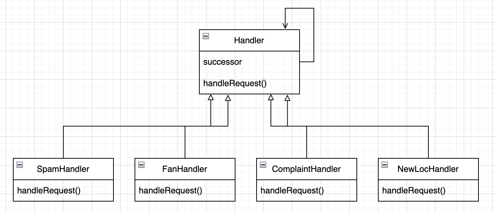
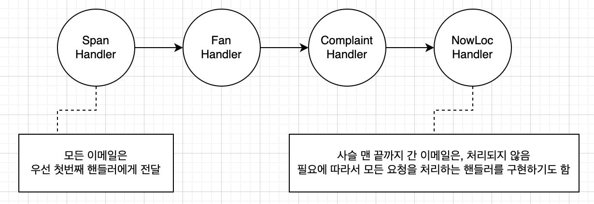
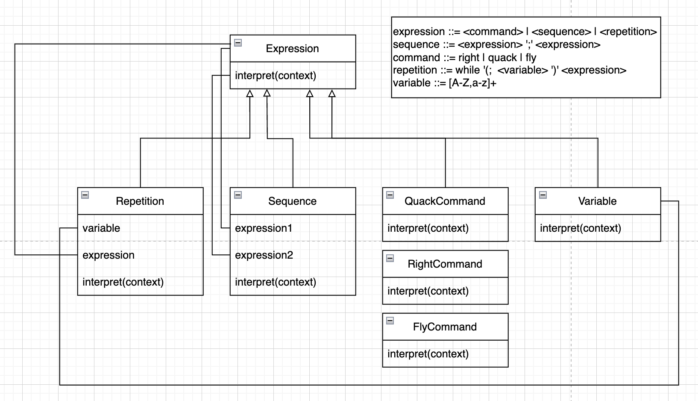
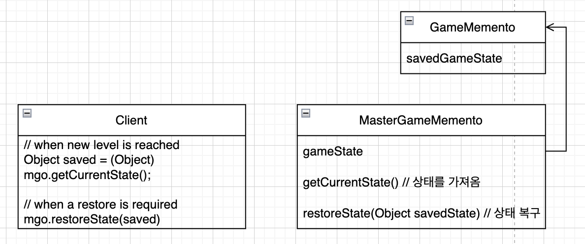
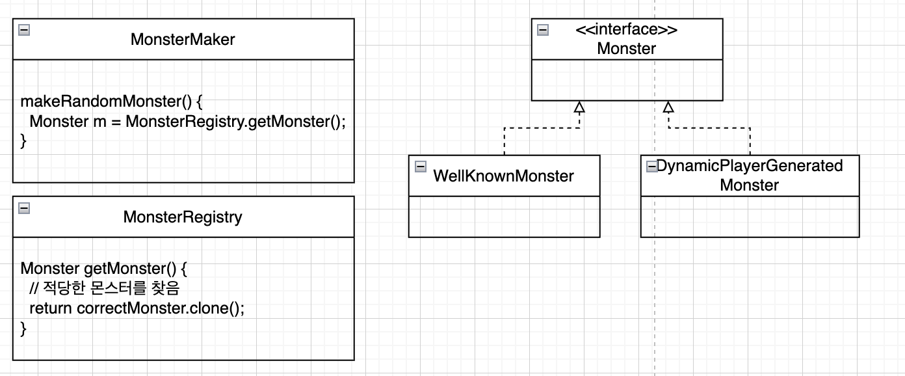
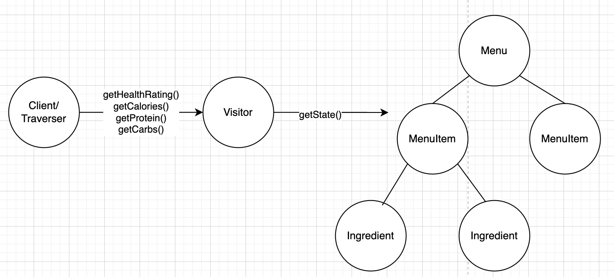

# 14. 기타 패턴

## 브리지 패턴

### 문제

* 리모콘도 바뀔 수 있고, TV도 바뀔 수 있음

### 언제?

* 구현 뿐만 아니라 추상화 된 부분까지 변경시켜야 하는 경우

### 장점

* 구현을 인터페이스에 완전히 결합시키지 않았기 때문에, 구현과 추상화된 부분을 분리 시킬 수 있음
* 추상화 된 부분과 구현 부분을 독립적으로 확장 가능

### 활용법

* 인터페이스와 실제 구현부를 서로 다른 방식으로 변경해야 하는 경우

### 단점

* 디자인이 복잡해 진다.

## 빌더 패턴

### 언제?

* 제품을 여러 단계로 나눠서 만들 수 있도록 제품 생산 단계들을 캡슐화 하고 싶을 때 사용
* 복합 객체가 생성되는 과정을 캡슐화

### 장점

* 여러 단계와 절차를 통해서 객체를 만들 수 있음
    * 팩토리 패턴에서는 한 단계에서 모든걸 처리 했음
* 제품 내부 구조를 클라이언트로 부터 보호할 수 있음
    * 클라이언트는 추상 인터페이스만 보기 때문에, 제품을 구현한 코드를 쉽게 바꿀 수 있음

### 단점

* 팩토리를 사용하는 경우에 비해, 객체를 만들기 위해 클라이언트에 대해 더 많이 알아야 한다.

## 역할 사슬 패턴

### 언제?

* 한 요청을 두개 이상의 객체에서 처리하고 싶을 때 사용
* 요청을 보낸 쪽과 받는 쪽을 분리

### 사용법

* 주어진 요청을 검토하기 위한 객체 사슬 생성
* 사슬에 속해있는 각 객체에서는 자기가 받은 요청을 검사하여 직접 처리하거나, 사슬에 들어있는 다른 객체에게 넘김

### 장점

* 객체에서는 사슬을 몰라도 되고, 사슬에 들어 있는 다른 객체에 대한 직접적인 레퍼런스를 가질 필요가 없음
* 사슬에 들어가는 개체를 바꾸거나, 순서를 바꿈으로써 역할을 동적으로 추가/제거 가능

### 단점

* 요청이 반드시 수행된다는 보장이 없음
* 디버깅하기 힘들 수 있음

## 플라이웨이트 패턴

### 언제?

* 어떤 클래스의 인스턴스 한 개만 가지고, 여러개의 가상 인스턴스를 제공하고 싶을 때
* 클래스의 인스턴스가 많이 필요하지만, 모두 같은 방식으로 제어할 수 있는 경우에 유용

### 장점

* 실행시, 객체 인스턴스의 개수를 줄여서 메모리를 절약

### 단점

* 특정 인스턴스만 다른 인스턴스와 다른 식으로 행동하도록 하는 것이 불가능

## 인터프리터 패턴

### 언제?

* 어떤 언어에 대한 인터프리터를 만들 때 사용
* 문법이 간단하고, 효율보다는 단순하게 만드는 것이 더 중요한 경우

### 사용법

* 각 표현식에 대해서 interpret()메서드를 호출

### 장점

* 각 문법 규칙을 클래스로 표현하기 때문에, 언어를 쉽게 구현할 수 있음
* 클래스 구조에 메소드만 추가하면 새로운 기능을 추가할 수 있다.
    * ex) 예쁘게 출력 등

### 단점

* 문법 규칙의 개수가 많아지면, 아주 복잡해 진다.
    * 파서/컴파일러 생성기를 사용하는 것이 나음

## 미디에어터 패턴

### 언제?

* 서로 관련된 객체 사이의 복잡한 통신과 제어를 한 곳으로 집중시키고자 하는 경우

### 사용법

* 상태가 바뀔 때마다 미디에어터에게 알려줌
* 미디에어터에서 보낸 요청에 응답
* 미디에이터: 모든 시스템을 제어할 수 있는 로직

### 장점

* 시스템과 각 객체를 분리시킴으로써 재사용성 향상
* 제어로직을 한 군데로 모아, 관리하기 쉬움
* 시스템은 미디에어터랑만 통신하면 되기 때문에 단순화 됨

### 단점

* 디자인을 잘 하지 못하면, 미디에어터 객체가 너무 복잡해 질 수 있음

## 메멘토 패턴

### 언제?

* 객체를 이전 상태로 복구시켜야 하는 경우
    * ex) 작업 취소

### 목적

* 핵심적인 기능을 담당하는 객체의 중요한 상태 저장
* 핵심적인 객체의 캡슐화 유지

### 사용법

* 메멘토 객체: 상태를 따로 저장하는 역할을 맡는 객체
    * 단일 역할 원칙을 준수하기 위해, 저장하고자 하는 상태를 핵심 객체로 부터 분리

### 장점

* 저장된 상태를 핵심 객체와는 다른 별도에 객체에 저장하기 때문에 안전
* 핵심 객체의 데이터를 캡슐화 된 상태로 유지 가능
* 복구 기능을 구현하기 쉬움

### 단점

* 저장하고 복구하는데 시간이 오래 걸릴 수 있음
* 자바에서는 저장할 때 직렬화 사용하는 것이 좋음

## 프로토타입 패턴

### 언제?

* 어떤 클래스의 인스턴스를 만드는 것이 자원/시간을 많이 잡아먹거나 복잡한 경우

### 사용법

* 기존 인스턴스를 복사하기만 하면, 새로운 인스턴스를 만들 수 있다.
* 클라이언트 코드에서 어떤 클래스의 인스턴스를 만드는지 모르는 상태에서도 새로운 인스턴스를 만들 수 있다.
* 상황에 따라서 객체를 생성하는 것보다 복사하는 것이 더 효율적일 수 있다.

### 장점

* 클라이언트에서는 새로운 인스턴스를 만드는 복잡한 과정을 몰라도 된다.

### 단점

* 객체의 복사본을 만드는 일이 매우 복잡한 경우가 있음

## 비지터 패턴

### 언제?

* 다양한 객체에 새로운 기능으르 추가해야 하는데, 캡슐화가 별로 중요하지 않은 경우

### 사용법

* 트래버셔(traverser) 객체:
    * 컴포지트 패턴을 쓰는 경우, 복합 객체 내에 속해 있는 모든 객체들에 접근하는 것을 도와주는 역할
    * 비지터 객체에서 각각의 상태를 가져올 수 있도록 도와준다.
* 상태를 가져오면 비지터가 각 상태들에 대해 다양한 작업을 처리 함

### 장점

* 구조 자체를 변경시키지 않으면서, 복합 객체 구조에 새로운 기능 추가
* 비지터에서 수행하는 기능과 관련된 코드를 한 곳에 집중시켜 놓을 수 있음

### 단점

* 복합 클래스의 캡슐화가 깨짐
* 트래버서가 있기 때문에, 복합 구조를 변경하기 더 어려워짐