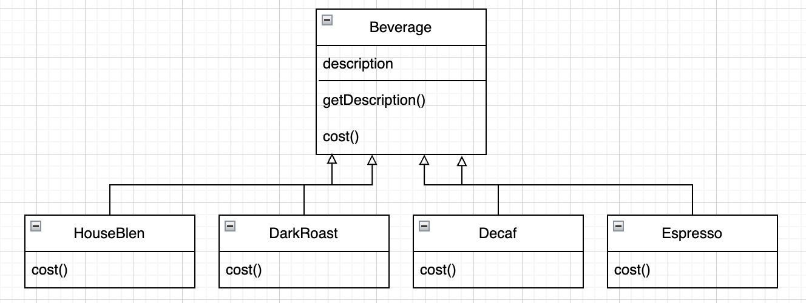
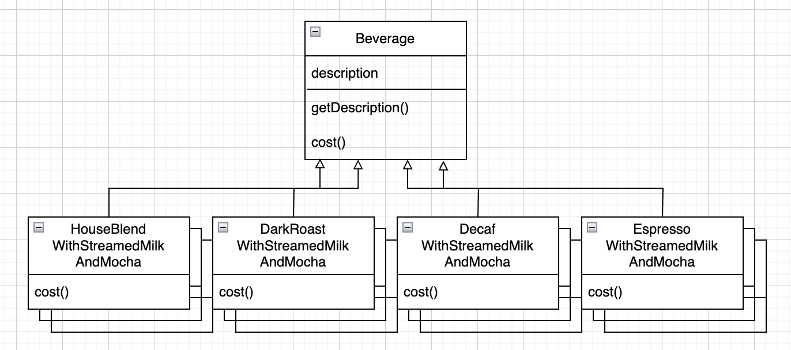
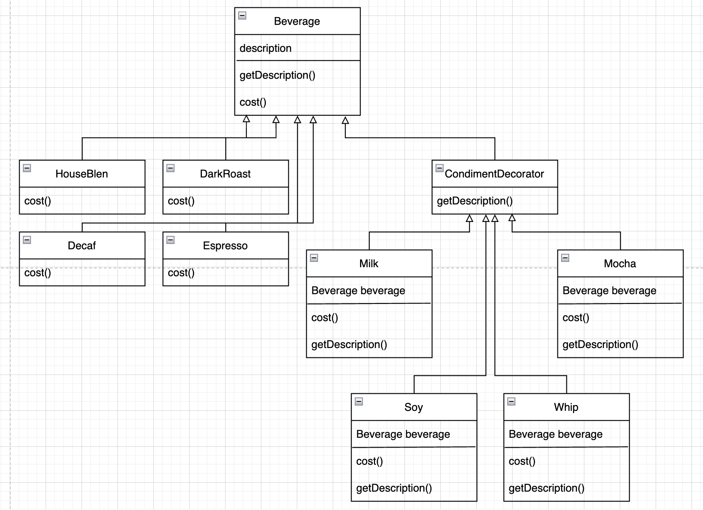

# 데코레이터 패턴

## 학습목표

상속을 남용하는 전형적인 예를 살펴보고,
<br>
객체 작성이라는 형식으로 실행중에 클래스를 꾸미는 방법 알기

## 스타버즈

<p align="center">

## 스팀 우유, 두유, 모카(초콜릿), 휘핑 크림 추가할 수 있어야 함

<p align="center">

```java
public class Beverage {
    // 추가된 항목의 가격을 계산
    public double cost() {
        double totalCost = 0;

        if (hasMilk()) {
            totalCost += milkCost;
        }
        if (hasSoy()) {
            totalCost += soyCost;
        }
        if (hasMocha()) {
            totalCost += mochaCost;
        }
        if (hasWhip()) {
            totalCost += whipCost;
        }

        return totalCost;
    }
}
```

```java
public class DarkRoast extends Beverage {
    public DarkRoast() {
        description = "최고의 다크 로스트 커피";
    }

    // 첨가된 항목에 따른 추가 가격 계산
    public double cost() {
        return super.cost() + mycost;
    }
}
```

* 문제점
    * 클래스의 개수가 폭발적으로 증가
    * 디자인원칙을 따르지 않음
        * 바뀌는 부분은 캡슐화 한다.
        * 상속보다는 구성
    * 요구사항이나 요인이 변경되었을 때 디자인에 미치는 영향
        * 첨가물이 바뀔때마다 기존코드(Beverage)를 수정해야 한다.
        * 특정 첨가물이 들어가면 안되는 경우도 관련 코드를 가지고 있음
            * ex) Tea 같은 서브 클래스도 hasWhip() 등의 메서드를 상속 받게 됨
        * 특정 첨가물이 두번 들어갈 수 없다.

## 다섯번째 객체지향 원칙 - OCP(Open-Closed Principle)

> 클래스는 확장에 대해서는 열려 있어야 하지만 코드 변경에 대해서는 닫혀 있어야 한다.

* 기능 추가에는 유연하고, 튼튼한 디자인
* 스트레티지 패턴, 데코레이터 패턴은 OCP를 만족
* 옵저버 패턴은 완벽히 만족하지 않음. 확장에는 열려있지만 변경할 경우는 코드 수정이 필요한 경우가 있다.

Q. 디자인을 할 때 모든 부분에서 OCP를 준수하려면?
<br>
A. 할 수 없음. <br>디자인한 것들 중 가장 바뀔 확률이 높은 부분을 중점적으로 살펴보고 원칙을 적용하는 방법이 가장 바람직 함

## 데코레이터 패턴

> 객체에 추가적인 요건을 동적으로 첨가한다.<br>
> 데코레이터는 서브클래스를 만드는 것을 통해서
> 기능을 유연하게 확장할 수 있는 방법을 제공한다.

<p align="center">

* Decorator
    * 각 구성요서는 직접쓰일 수도 있고, 데코레이터로 감싸서 쓰일 수도 있다.
    * 각 데코레이터 안에는 Component 객체(구성요소에 대한 레퍼런스)가 들어 있음
    * Component 의 상태를 확장할 수 있다.
    * 새로운 메서드 추가 가능
        * 하지만 Component 에 원래 메서드 호출하기 전후에 별도의 작업을 처리하는 방식으로 새로운 기능을 추가
    * Component, Decorator 는 인터페이스여도 됨

## 스타버즈에 데코레이터 패턴 설계

<p align="center">

## 스타버즈에 데코레이터 패턴 구현

```java
public abstract class Beverage {
    private String description = "Unknown Beverage";

    public Beverage() {
    }

    public Beverage(final String description) {
        this.description = description;
    }

    public String getDescription() {
        return description;
    }

    public abstract double cost();
}
```

```java
public abstract class CondimentDecorator extends Beverage {

    public abstract String getDescription();
}
```

```java
public class Espresso extends Beverage {
    public Espresso() {
        super("Espresso");
    }

    @Override
    public double cost() {
        return 1.99;
    }
}
```

```java
public class Mocha extends CondimentDecorator {
    private final Beverage beverage;

    public Mocha(final Beverage beverage) {
        this.beverage = beverage;
    }

    @Override
    public String getDescription() {
        return beverage.getDescription() + ", Mocha";
    }

    @Override
    public double cost() {
        return beverage.cost() + 0.20;
    }
}
```

Q1. 특정 구상 구성요소인지 확인한 다음 작업을 처리하는 경우, 이 코드를 쓸 수 없지 않나?
A1. 맞다. 특정 구상 구성요소인지를 알아야 한다면 데코레이터 패턴을 쓸 수 없음

Q2. 데코레이터를 빼먹는 실수를 할 우려는?
A2. 팩토리나 빌더 같은 다른 패턴을 써서 해결할 수 있음

## java.io 클래스와 데커레이터 패턴

```text
java.lang.Object
   ↳ java.io.InputStream
        ↳ FileInputStream
        ↳ ByteArrayInputStream
        ↳ FilterInputStream
             ↳ BufferedInputStream
             ↳ DataInputStream
             ↳ PushbackInputStream
        ↳ ObjectInputStream
        ↳ PipedInputStream
        ↳ SequenceInputStream
```

* FilterInputStream 가 추상데코레이터로 InputStream 대한 레퍼런스가 들어 있다. 