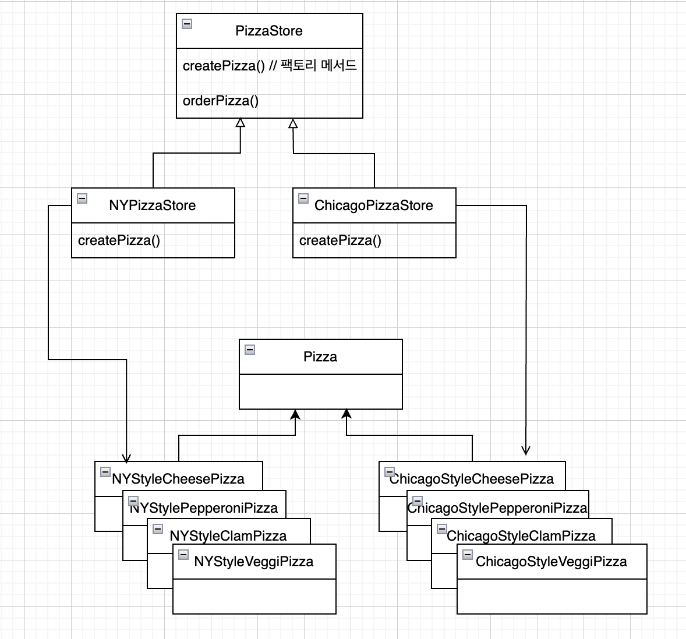

# Chapter4. 팩토리 패턴

## 이 장에서 배울 것

객체의 인스턴스를 만드는 작업이 항상 공개되어 있어야 하는 것은 아니며
<br>
모든 것을 공개 했다가 결합과 관련된 문제가 생길 수 있다.

## new 에는 어떤 문제가 있는 걸까?

* 인터페이스에 맞춰서 코딩할 때의 장점
    * 다형성 덕분에 어떤 클래스든 특정 인터페이스만 구현하면 사용할 수 있다.
* 구상클래스를 사용하면?
    * 새로운 구상 클래스가 추가될 때마다 코드를 고쳐야 하기 때문에
    * 변화에 닫혀 있는 코드가 된다.
* 어떻게 해야 할까?
    * 첫번째 디자인 원칙 적용 - 바뀔 수 있는 부분을 찾아내서 바뀌지 않는 부분과 분리 시켜야 한다.

## 피자가게 코드

### 원래코드

```java
Pizza orderPizza() {
    Pizza pizza = new Pizza();

    pizza.prepare();
    pizza.bake();
    pizza.cut();
    pizza.box();
    return pizza;
}
```

### 변경1. 올바른 피자 종류를 고르고 피자를 만들기 위한 코드 추가

```java
Pizza orderPizza() {
    Pizza pizza;

    if (type.equals("cheese")) {
        pizza = new CheesePizza();
    } else if (type.equals("greek")) {
        pizza = new GreekPizza();
    } else if (type.equals("pepperoni")) {
        pizza = new PepperoniPizza();
    }

    pizza.prepare();
    pizza.bake();
    pizza.cut();
    pizza.box();
    return pizza;
}
```

### 변경2. 피자 종류를 추가해야 함

* 조개 피자, 야채 피자 추가
* 그리스식 피자 제외

```java
Pizza orderPizza() {
    Pizza pizza;

    // 바뀌는 부분 - 캡슐화 필요!
    if (type.equals("cheese")) {
        pizza = new CheesePizza();
    } else if (type.equals("pepperoni")) {
        pizza = new PepperoniPizza();
    } else if (type.equals("clam")) {
        pizza = new PepperoniPizza();
    } else if (type.equals("veggie")) {
        pizza = new PepperoniPizza();
    }

    // 바뀌지 않는 부분
    pizza.prepare();
    pizza.bake();
    pizza.cut();
    pizza.box();
    return pizza;
}
```

## 객체 생성 부분을 캡슐화

* 새로 만들 객체에는 팩토리 라는 이름을 붙이기로 한다.
    * 팩토리: 객체 생성을 처리하는 클래스

```java
public class SimplePizzaFactory {
    public Pizza createPizza(String type) {
        Pizza pizza = null;

        if (type.equals("cheese")) {
            pizza = new CheesePizza();
        } else if (type.equals("pepperoni")) {
            pizza = new PepperoniPizza();
        } else if (type.equals("clam")) {
            pizza = new PepperoniPizza();
        } else if (type.equals("veggie")) {
            pizza = new PepperoniPizza();
        }

        return pizza;
    }
}
```

* 간단한 팩토리를 정적 메소드로 정의하는 기법도 많이 쓰임 (정적 팩토리)
    * 장점: 객체를 생성히 위한 메소드를 실행시키기 위해서 객체의 인스턴스를 만들지 않아도 된다.
    * 단점: 서브클래스를 만들어서 객체 생성 메소드의 행동을 변경시킬 수 없다.

```java
public class PizzaStore {
    private final SimplePizzaFactory simplePizzaFactory;

    public PizzaStore(SimplePizzaFactory simplePizzaFactory) {
        this.simplePizzaFactory = simplePizzaFactory;
    }

    public Pizza orderPizza(final String order) {
        final var pizza = simplePizzaFactory.createPizza(order);

        pizza.prepare();
        pizza.bake();
        pizza.cut();
        pizza.box();

        return pizza;
    }
}
```

## 간단한 팩토리(Simple Factory)

<p align="center">

```java
public class SimplePizzaFactory {
    public Pizza createPizza(final String type) {
        Pizza pizza = null;

        if (type.equals("cheese")) {
            pizza = new CheesePizza();
        } else if (type.equals("pepperoni")) {
            pizza = new PepperoniPizza();
        } else if (type.equals("clam")) {
            pizza = new ClamPizza();
        } else if (type.equals("veggie")) {
            pizza = new VeggiePizza();
        }

        return pizza;
    }
}
```

```java
public class PizzaStore {
    private final SimplePizzaFactory simplePizzaFactory;

    public PizzaStore(final SimplePizzaFactory simplePizzaFactory) {
        this.simplePizzaFactory = simplePizzaFactory;
    }

    public Pizza orderPizza(final String order) {
        final var pizza = simplePizzaFactory.createPizza(order);

        pizza.prepare();
        pizza.bake();
        pizza.cut();
        pizza.box();

        return pizza;
    }
}
```

```java
public class Pizza {
    public void prepare() {
    }

    public void bake() {
    }

    public void cut() {
    }

    public void box() {
    }
}

// 필요하면 원하는 메서드를 오버라이드 할 수 있음
public class CheesePizza extends Pizza {
}

```

```java
NYPizzaFactory nyFactory = new NYPizzaFactory();
PizzaStore store = new PizzaStore(nyFactory);
store.

order("Veggie");

ChicagoPizzaFactory chicagoFactory = new ChicagoPizzaFactory();
PizzaStore store = new PizzaStore(chicagoFactory);
store.

order("Veggie");
```

* 패턴은 아님

## 피자 프랜차이즈 사업

### 변경3. 지역별 프랜차이즈가 생김(뉴욕 스타일, 시카고 스타일, 캘리포니아 스타일 등)

* 문제점: 굽는 방식이 달리진다거나 종종 피자를 자르는 것을 까먹어 버리는 일이 발생
    * 피자 가게와 피자 제작 과정 전체를 하나로 묶어주는 프레임워크 필요

<p align="center">

* 해결: 팩토리 메소드를 사용하여 서브클래스로 객체 생성을 위임
    * createPizza() 메서드를 PizzaStore 에 다시 넣고, 추상 메소드로 선언
    * 각 지역마다 고유 스타일에 맞게 PizzaStore 의 서브클래스를 생성하여 서브클래스에서 객체 생성
* 팩토리 메소드
    * 객체 생성을 처리하며
    * 객체를 생성하는 작업을 서브클래스에 캡슐화
        * 수퍼클래스에 있는 클라이언트 코드와 서브클래스에 있는 객체 생성 코드를 분리

```java
public abstract class PizzaStore {
    // 수퍼클래스에 있는 클라이언트 코드
    public Pizza orderPizza(final String order) {
        final var pizza = createPizza(order);

        pizza.prepare();
        pizza.bake();
        pizza.cut();
        pizza.box();

        return pizza;
    }

    // 서브클래스로 위임할 객체 생성 코드 
    // 팩토리 메서드
    protected abstract Pizza createPizza(String type);
}
```

```java
public class NyPizzaStore extends PizzaStore {

    @Override
    protected Pizza createPizza(String type) {
        return switch (type) {
            case "cheese" -> new NYStyleCheesePizza();
            case "veggie" -> new NYStyleVeggiePizza();
            case "clam" -> new NYStyleClamPizza();
            case "pepperoni" -> new NYStylePepperoniPizza();
            default -> null;
        };
    }
}
```

## 팩토리 메소드 패턴

### 피자가게 예시

<p align="center">

* PizzaStore(추상 생산자 클래스)
    * 팩토리 메서드 정의
    * 추상 제품 클래스에 의존하는 코드가 들어있는 경우도 있음 (ex. orderPizza()))
* NYPizzaStore, ChicagoPizzaStore(구상 생산자 클래스)
    * createPizza(): 팩토리 메소드, 제품 생산
* 관점을 바꾸어서, 제품에 관한 지식을 각 생산자에서 캡슐하는 방법에 초점
    * 병렬 클래스의 계층구조
    * 제품 클래스(Pizza), 생산자 클래스(PizzaStore)가 상위 인터페이스로 추상 클래스를 가지고 있고, 구체적인 구현은 구상클래스가 책임지고 있다.
    * 팩토리 메소드(PizzaStore#createPizza)는 이러한 지식을 캡슐화 시크는데 있어서 가장 핵심적인 역할을 맡고 있다.

### 팩토리 메소드 패턴

> 객체를 생성하기 위한 인터페이스를 정의하는데<br>
> 어떤 클래스의 인스턴스를 만들지는 서브클래스에서 결정

<p align="center">

## 여섯번째 객체지향 원칙 - 의존성 뒤집기 원칙

> 추상화 된 것에 의존하도록 만들어라<br>
> 구상 클래스에 의존하도록 만들지 않도록 한다.

<p align="center">

* 인터페이스에 맞춰서 프로그래밍 한다라는 원칙이랑 비슷하지만 강조하는바가 다름
    * 의존성 뒤집기 원칙에서는 추상화를 더 많이 강조
* 고수준 구성요소가 저수준 구성요소에 의존하면 안된다는 것이 내포 되어 있음
    * 고수준 구성요소: 저수준 구성요소에 의해 정의되는 행동이 들어 있는 구성 요소
    * PizzaStore 고수준, Pizza 저수준
* 구상 클래스처럼 구체적인 것이 아닌 추상 클래스나 인터페이스와 같이 추상적인 것에 의존하는 코드를 만들어야 한다.(고수준 모듈, 저수준 모듈 모두)
* 원칙을 지키는데 도움이 될만한 가이드라인 - 항상 지킬 수는 없음
    * 어떤 변수에도 구상 클레스에 대한 레퍼런스를 저장하지 않는다.
        * new 연산자 사용하지 말자. 대신 팩토리를 사용
    * 구상 클래스에서 유도된 클래스를 만들지 않는다.
        * 구상 클래스가 아닌 인터페이스나 추상 클래스로 부터 만들어야 함
    * 베이스 클래스에 이미 구현되어 있는 메소드를 오버라이드 하지 않는다.
        * 오버라이드 한다는 것은 추상화가 제대로 된것이 아님

## 신선한 재료 전달을 위해 원재료를 생산하는 공장을 만듦

* 팩토리: 원재료를 생산하는 공장을 만들고 분점까지 재료를 배달

```java
// 인터페이스에 각 재료별 생성 메소드를 정의
// - 모든 팩토리 인스턴스에서 공통적으로 사용하는 부분이 있다면, 추상클래스로 만들어도 됨
public interface PizzaIngredientFactory {
    Dough createDough();

    Sauce createSauce();

    Cheese createCheese();

    Veggies[] createVeggies();

    Pepperoni createPepperoni();

    Clams createClams();
}
```

```java
public class NYPizzaIngredientFactory implements PizzaIngredientFactory {
    @Override
    public Dough createDough() {
        return new ThinCrustDough();
    }

    @Override
    public Sauce createSauce() {
        return new MarinaraSauce();
    }

    @Override
    public Cheese createCheese() {
        return new ReggianoCheese();
    }

    @Override
    public Veggies[] createVeggies() {
        return new Veggies[]{new Garlic(), new Onion(), new Mushroom(), new RedPepper()};
    }

    @Override
    public Pepperoni createPepperoni() {
        return new SlicedPepperoni();
    }

    @Override
    public Clams createClams() {
        return new FreshClams();
    }
}
```

* 피자 클래스 변경

```java
public abstract class Pizza {
    private final String name;

    // 각 피자마다 준비 과정에서 쓰이는 원재료들이 있음
    private Dough dough;
    private Sauce sauce;
    private Cheese cheese;
    private Clams clam;
    private Veggies[] veggies;
    private Pepperoni pepperoni;

    public Pizza(final String name) {
        this.name = name;
    }

    // 추상 메서드로 변경
    public abstract void prepare();

    public void bake() {
        System.out.println("Bake for 25 minutes at 350");
    }

    public void cut() {
        System.out.println("Cutting the pizza into diagonal slices");
    }

    public void box() {
        System.out.println("Place pizza in official PizzaStore box");
    }

    public String getName() {
        return name;
    }

    public void setDough(Dough dough) {
        this.dough = dough;
    }

    public void setSauce(Sauce sauce) {
        this.sauce = sauce;
    }

    public void setCheese(Cheese cheese) {
        this.cheese = cheese;
    }

    public void setClam(Clams clam) {
        this.clam = clam;
    }

    public void setVeggies(Veggies[] veggies) {
        this.veggies = veggies;
    }

    public void setPepperoni(Pepperoni pepperoni) {
        this.pepperoni = pepperoni;
    }

    @Override
    public String toString() {
        return "Pizza{" +
                "name='" + name + '\'' +
                '}';
    }
}
```

```java
public class CheesePizza extends Pizza {
    private final PizzaIngredientFactory ingredientFactory;

    public CheesePizza(final String name, final PizzaIngredientFactory ingredientFactory) {
        super(name);
        this.ingredientFactory = ingredientFactory;
    }

    // 재료가 필요할 떄마다, 팩토리에 있는 메소드를 호출해서 만들어 옴    
    @Override
    public void prepare() {
        System.out.println("Preparing " + super.getName());
        super.setDough(ingredientFactory.createDough());
        super.setSauce(ingredientFactory.createSauce());
        super.setCheese(ingredientFactory.createCheese());
    }
}
```

* 스토어: 피자를 생산하고 주문을 받

```java
public abstract class PizzaStore {

    public Pizza orderPizza(final String order) {
        final var pizza = createPizza(order);

        pizza.prepare();
        pizza.bake();
        pizza.cut();
        pizza.box();

        return pizza;
    }

    protected abstract Pizza createPizza(String type);
}
```

```java
public class NYPizzaStore extends PizzaStore {
    @Override
    protected Pizza createPizza(final String type) {
        final PizzaIngredientFactory pizzaIngredientFactory = new NYPizzaIngredientFactory();

        // 피자를 만들 때 사용할 재료를 만들기 위해 사용할 팩토리를 전달         
        return switch (type) {
            case "cheese" -> new CheesePizza("New York Style Cheese Pizza", pizzaIngredientFactory);
            case "veggie" -> new VeggiePizza("New York Style Veggie Pizza", pizzaIngredientFactory);
            case "clam" -> new ClamPizza("New York Style Clam Pizza", pizzaIngredientFactory);
            case "pepperoni" -> new PepperoniPizza("New York Style Pepperoni Pizza", pizzaIngredientFactory);
            default -> null;
        };
    }
}
```

## 추상 팩토리 패턴

> 인터페이스를 이용하여 서로 관련된, 또는 의존하는 객체를 구상 클래스를 지정하지 않고도 생성할 수 있다.

* 제품군을 만들 때 사용할 수 있는 패턴
* 클라이언트와 팩토리에서 생산되는 제품을 분리시킬 수 있다.

<p align="center"> 

* ConcreteFactory1, ConcreteFactory2: 서로 다른 제품군을 구현

<p align="center">

* NYPizzaStore에서 직접 Dough, Sauce, Cheese, Clams에 접근하지 않았지만 <br>NYPizzaStore에서 생성한 Pizza 내부에서 PizzaIngredientFactory를
  이용해서 각 재료를 가져왔으므로 <br>의존성이 연결되어 있다.

Q. 추상 팩토리 패턴 뒤에는 팩토리 메소드 패턴이 숨어있는 건가?
<br>
A. 추상 팩토리: 원래 일련의 제품들을 생성하는데 쓰일 인터페이스를 정의하기 위해 만들어진 것
<br>인터페이스에 있는 각 메소드는 구상 제품을 생산하는 일을 맡고 있고<br>추상 팩토리의 서브클래스를 만들어서 각 메소드의 구현을 제공<br>따라서 자연히 팩토리 메소드 패턴을 사용하게 된다.

## 팩토리

* 객체 생성을 캡슐화 할 수 있음
* 팩토리의 종류
    * 간단한 팩토리: 클라이언트와 구상 클래스를 분리시키기 위한 간다한 기법
    * 팩토리 메소드 패턴: 상속을 활용. 개체 생성이 서브클래스에게 위임. 서브 클래스에서는 팩토리 메소드를 구현하여 객체를 생산
    * 추상 팩토리 패턴: 객체 구성을 활용. 객체 생성이 팩토리 인터체이스에서 선언한 메소드들에서 구현
* 각 패턴을 언제 사용하는가
    * 팩토리 메소드 패턴: 어떤 클래스에서 인스턴트를 만드는 일을 서브클래스에 넘김(격리)
    * 추상 팩토리 패턴: 구상 클래스에 직접 의존하지 않고도 서로 관련된 객체들로 이루어진 제품 군을 만들기 위한 용도
* 팩토리는 구상 클래스가 아닌 추상 클래스/인터페이스에 맞춰 코딩할 수 있게 해주는 강력한 기법이다.

## 용어

* 추상 컴포넌트(abstract component): 공통된 인터페이스나 추상 클래스로 정의되어 있으며, 구체적인 구현은 제공되지 않습니다. 이를 통해 공통된 동작이나 메서드를 정의합니다.
* 구상 컴포넌트(concrete component): 추상 컴포넌트를 구현하는 구체적인 클래스입니다. 실제 동작을 정의하며, 이 클래스가 다른 객체들에 의해 확장되거나 장식될 수 있습니다.