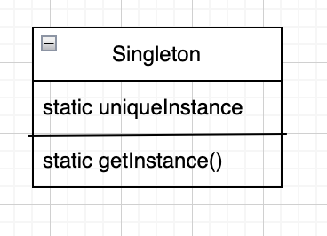

# Chapter5. 싱글톤 패턴

* 인스턴스가 하나 뿐인 특별한 객체를 만들 수 있게 해 주는 패턴

## 용도

* 하나만 있어야 하는 객체를 생성할 때 사용
    *
    * 인스턴스를 두개 이상 만들면 자원을 불필요하게 잡아먹고, 결과에 일관성이 없어지는 등 문제가 발생
* ex) 쓰레드 풀, 캐시, 대화상자, 사용자 설정, 레지스트리 설정 처리 객체, 로그 기록용 객체, 디바이스 드라이버

## 특징

* 객체 인스턴스가 하나
* 전역 변수처럼 객체 인스턴스를 어디서든지 액세스 가능
* 전역 변수의 단점도 없음 - 필요할 때만 객체를 생성
    * 전역변수의 단점: 필요 없을 때도 생성되어 메모리를 잡아먹음

## 고전적인 싱글턴 패턴 구현법

```java
public class Singleton {
    private static Singleton uniqueInstance;

    private Singleton() {
    }

    public static Singleton getInstance() {
        // 게으른 인스턴스 생성(lazy instantiation): 인스턴스가 필요할 때 생성
        if (uniqueInstance == null) {
            uniqueInstance = new Singleton();
        }
        return uniqueInstance;
    }
}
```

## 문제 발생! 멀티 쓰레드 환경에서 문제가 발생할 수 있음

* getInstance()를 동기화 시키면 간단하게 해결됨

```java
public class Singleton {
    private static Singleton uniqueInstance;

    private Singleton() {
    }

    // 한 쓰레드가 메소드의 사용을 끝나기 전까지 다른 쓰레드는 기다림
    public static synchronized Singleton getInstance() {
        if (uniqueInstance == null) {
            uniqueInstance = new Singleton();
        }
        return uniqueInstance;
    }
}
```

* 문제점: 동기화 -> 필요 없는 대기 -> 속도문제 발생
    * uniqueInstance 에 Singleton 인스턴트를 대입할 때까지만 동기화 필요
* 해결 방법1. 속도가 중요하지 않은 경우는 그대로 둔다.
    * 성능이 100배 정도 저하
* 해결 방법2. 인스턴스를 필요할 때 만들지 말고, 처음부터 생성

```java
public class Singleton {
    private static Singleton uniqueInstance = new Singleton;

    private Singleton() {
    }

    // 한 쓰레드가 메소드의 사용을 끝나기 전까지 다른 쓰레드는 기다림
    public static synchronized Singleton getInstance() {
        return uniqueInstance;
    }
}
```

* 해결 방법3. DCL(Double Checking Locking)을 써서 getInstance()에서 동기화 되는 부분을 줄임
    * 자바5 이상에서 사용

```java
public class Singleton {
    private volatile static Singleton instance;

    private Singleton() {
    }

    public static Singleton getInstance() {
        if (instance == null) {
            synchronized (Singleton.class) {
                if (instance == null) {
                    instance = new Singleton();
                }
            }
        }
        return instance;
    }
}
```

## 싱글턴 패턴

> 해당 클래스의인스턴스가 하나만 만들어지고,<br>어디서든지 그 인스턴스에 접근할 수 있도록 하기 위한 패턴

<p align="center">

* 어떤 식으로 구현할까?
    * 클래스에서 자신의 단 하나뿐인 인스턴스를 관리하도록 만들면 됨
        * 추가로, 다른 어떤 클래스에서도 자신의 인스턴스를 추가로 만들지 못하도록 해야 함
    * 어디서든지 그 인스턴스에 접근할 수 있도록 해야 함
    * 게으르게 생성되도록 구현할 수도 있음

## 질문들

* 클래스 로더와 관련된 문제가 있을 수 있음
    * 클래스 로더가 2개 이상으로 정의되면, 클래스 로더 마다 네임스페이스가 다르기 때문에, Singleton 인스턴스가 여러개 만들어질 수 있음
    * 클래스 로더를 여러개 사용하면서 싱글턴을 사용한다면 조심해야 함

## 요즘에 사용되는 Singleton 객체 구현

### Static Inner Class

```java
public class Singleton {
    private Singleton() {
    }

    private static class SingletonHolder {
        private static final Singleton INSTANCE = new Singleton();
    }

    public static Singleton getInstance() {
        return SingletonHolder.INSTANCE;
    }
}
```

* 장점: 지연 초기화와 스레드 안전성 보장, 코드가 간결
* 단점: 별다른 단점 없음, 권장되는 방법 중 하나

### enum

```java
public enum Singleton {
    INSTANCE;
}
```

* 장점: Reflection에 안전하고, 지연 초기화와 스레드 안전성 보장
* 단점: 직관적이지 않을 수 있음

## 용어

* 정적 메소드 = 클래스 메소드
* volatile 키워드
    * Java 멀티스레드 프로그래밍에서 사용되는 키워드
    * 변수를 모든 스레드에서 일관되게 보이도록 보장
    * volatile은 특정 상황에서 가시성과 일관성을 유지하며, 특히 변수 값을 여러 스레드가 공유하고 업데이트할 때 유용
