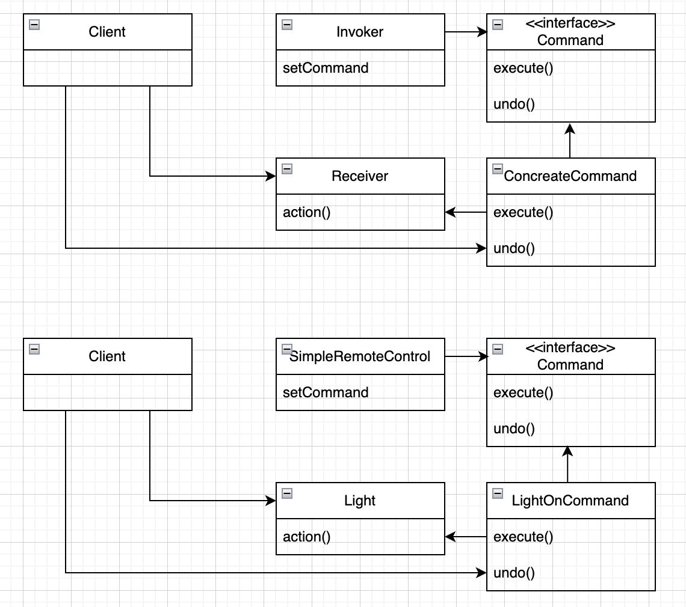
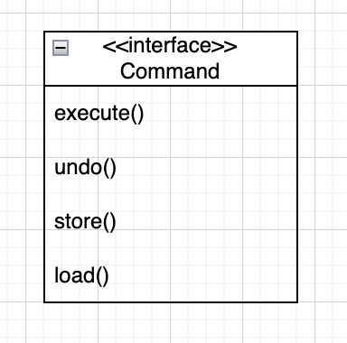

# Chapter6. 커맨드 패턴

* 이 장에서 배울 것
    * 메소드 호출을 캡슐화
    * 메소드 캡슐화의 장점
        * 계산 과정의 각 부분들을 결정화 시킬 수 있기 때문에, 계산하는 코드를 호출한 객체에서는 어떤 식으로 처리해야 하는지 전혀 신경 쓰지 않아도 된다
    * 커맨드 패턴의 활용 예
        * 로그 기록용으로 저장
        * 취소

## 커맨드 패턴

### 객체마을 식당의 예

* 주문서: 주문한 메뉴를 캡슐화 - 커맨드
    * Order#orderUp: 식사를 준비하기 위한 행동을 캡슐화한 메소드
* 웨이트리스: Order#orderUp을 호출 - 인보커
    * Waitress#takeOrder(order): 여러 고객이 여러 주문서를 매개 변수로 전달
* 주방장: 식사를 준비하는데 필요한 정보 - 리시버
    * Waitress#takeOrder에서 Order#orderUp을 호출하면 주방장이 주문을 받아서 음식을 만들기 위한 메소드 전부 처리
    * 주방장, 웨이트리스는 완전히 분리되어 있음
        * 웨이트리스: 메소드를 호출
        * 주방장: 주문서로부터 할일을 전달 받음
* 클라이언트
    * 커맨드 객체 생성
        * 커맨드 객체 안에는 리시버에 대한 정보도 같이 들어 있음
    * 인보커 객체(웨이트리스)의 setCommand(command) 호출하여 커맨드 객체 저장
        * Command#execute 호출(주문서)하면 리시버(주방장)의 action1(), action2() 가 실행됨
    * 필요한 시점에 인보커에게 그 명령을 실행시켜 달라는 명령을 함
        * 인보커는 한 번만 작업을 처리하고 커맨드 삭제할 수도 있고, 저장해 둔 명령어를 여러번 수행할 수도 있다.

### 리모콘의 예

* 버튼이 눌렀을 때 호출되는 코드(인보커) / 특정업체에서 제공한, 실제로 일을 처리하는 코드(리시버)
* 커맨드 인터페이스

```java
public interface Command {
    void execute();
}

```

* 커맨드 구현체

```java
public class LightOnCommand implements Command {
    private final Light light;

    public LightOnCommand(final Light light) {
        this.light = light;
    }

    @Override
    public void execute() {
        light.on();
    }
}
```

* 리모콘
    * 커맨드 객체가 하나 - 리모콘 버튼의 개수가 하나
    * 인보커

```java
public class SimpleRemoteControl {
    private Command command;

    public SimpleRemoteControl() {
    }

    public void setCommand(final Command command) {
        this.command = command;
    }

    public void buttonWasPressed() {
        command.execute();
    }
}
```

```java

@Test
public void testSimpleRemoteControl() {
    final var remote = new SimpleRemoteControl();

    final var light = new Light();
    final var lightOnCommand = new LightOnCommand(light);

    remote.setCommand(lightOnCommand);
    remote.buttonWasPressed();
}
```

## 커맨드 패턴의 정의

> 요구 사항을 객체로 캡슐화 할 수 있으며,
> <br> 매개변수를 써서 여러 가지 다른 요구 사항을 집어 넣을 수도 있다.
> <br> 요청 내역을 큐에 저장하거나 로그로 기록할 수도 있으며,
> <br> 작업 취소도 가능하다.

<p align="center">

### 메타 커맨드 패턴

> 명령들로 이루어진 매크로를 만들어서 여러 개의 명령을 한 번에 실행

## 리모콘 코드

### 리모콘 - 인보커

```java
public class RemoteControl {
    private final Command[] onCommands;
    private final Command[] offCommands;

    public RemoteControl() {
        onCommands = new Command[7];
        offCommands = new Command[7];

        for (int i = 0; i < onCommands.length; i++) {
            onCommands[i] = new NoCommand();
            offCommands[i] = new NoCommand();
        }
    }

    public void setCommand(final int index, final Command onCommand, final Command offCommand) {
        onCommands[index] = onCommand;
        offCommands[index] = offCommand;
    }

    public void onButtonWasPressed(int slot) {
        onCommands[slot].execute();
    }

    public void offButtonWasPressed(int slot) {
        offCommands[slot].execute();
    }

    @Override
    public String toString() {
        final StringBuilder stringBuilder = new StringBuilder();

        stringBuilder.append("\n---------- Remote Control -----------\n");
        for (int i = 0; i < onCommands.length; i++) {
            final var str = "[slot " + i + "] "
                    + onCommands[i].getClass().getName()
                    + "    "
                    + offCommands[i].getClass().getName() + "\n";
            stringBuilder.append(str);
        }

        return stringBuilder.toString();
    }
}
```

### 커맨드 클래스

```java
public class StereoOnForCDCommand implements Command {
    private final Stereo stereo;

    public StereoOnForCDCommand(final Stereo stereo) {
        this.stereo = stereo;
    }

    @Override
    public void execute() {
        stereo.on();
        stereo.setCd();
        stereo.setVolume(11);
    }
}
```

```java
public class NoCommand implements Command {
    @Override
    public void execute() {
        System.out.println("No command");
    }
}
```

* 널 객체(null object)
    * 딱히 리턴할 객체는 없지만, 클랑이언트 쪽에서 null을 처리하지 않아도 되도록 하고 싶을 때

### 리모컨 테스트 - 클라이언트

```java

@Test
void testRemoteControl() {
    final var remoteControl = new RemoteControl();

    final var lightForLivingRoom = new Light("Living Room");
    final var lightOnCommandForLivingRoom = new LightOnCommand(lightForLivingRoom);
    final var lightOffCommandForLivingRoom = new LightOffCommand(lightForLivingRoom);

    final var lightForKitchen = new Light("Kitchen");
    final var lightOnCommandForKitchen = new LightOnCommand(lightForKitchen);
    final var lightOffCommandForKitchen = new LightOffCommand(lightForKitchen);

    final var ceilingFan = new CeilingFan("Living Room");
    final var ceilingFanHighCommand = new CeilingFanHighCommand(ceilingFan);
    final var ceilingFanOffCommand = new CeilingFanOffCommand(ceilingFan);

    final var garageDoor = new GarageDoor();
    final var garageOnCommand = new GarageDoorOpenCommand(garageDoor);
    final var garageCloseCommand = new GarageDoorCloseCommand(garageDoor);

    final var stereo = new Stereo("Living Room");
    final var stereoOnForCDCommand = new StereoOnForCDCommand(stereo);
    final var stereoOffCommand = new StereoOffCommand(stereo);

    remoteControl.setCommand(0, lightOnCommandForLivingRoom, lightOffCommandForLivingRoom);
    remoteControl.setCommand(1, lightOnCommandForKitchen, lightOffCommandForKitchen);
    remoteControl.setCommand(2, ceilingFanHighCommand, ceilingFanOffCommand);
    remoteControl.setCommand(3, garageOnCommand, garageCloseCommand);
    remoteControl.setCommand(4, stereoOnForCDCommand, stereoOffCommand);

    System.out.println(remoteControl);

    remoteControl.onButtonWasPressed(0);
    remoteControl.offButtonWasPressed(0);
    remoteControl.onButtonWasPressed(1);
    remoteControl.offButtonWasPressed(1);
    remoteControl.onButtonWasPressed(2);
    remoteControl.offButtonWasPressed(2);
    remoteControl.onButtonWasPressed(3);
    remoteControl.offButtonWasPressed(3);
    remoteControl.onButtonWasPressed(4);
    remoteControl.offButtonWasPressed(4);
}
```

### 결과

```text
---------- Remote Control -----------
[slot 0] main.java.com.example.designpatterns.chp6_command.command.LightOnCommand    main.java.com.example.designpatterns.chp6_command.command.LightOffCommand
[slot 1] main.java.com.example.designpatterns.chp6_command.command.LightOnCommand    main.java.com.example.designpatterns.chp6_command.command.LightOffCommand
[slot 2] main.java.com.example.designpatterns.chp6_command.command.CeilingFanHighCommand    main.java.com.example.designpatterns.chp6_command.command.CeilingFanOffCommand
[slot 3] main.java.com.example.designpatterns.chp6_command.command.GarageDoorOpenCommand    main.java.com.example.designpatterns.chp6_command.command.GarageDoorCloseCommand
[slot 4] main.java.com.example.designpatterns.chp6_command.command.StereoOnForCDCommand    main.java.com.example.designpatterns.chp6_command.command.StereoOffCommand
[slot 5] main.java.com.example.designpatterns.chp6_command.command.NoCommand    main.java.com.example.designpatterns.chp6_command.command.NoCommand
[slot 6] main.java.com.example.designpatterns.chp6_command.command.NoCommand    main.java.com.example.designpatterns.chp6_command.command.NoCommand

Living Room Light is on
Living RoomLight is off
Kitchen Light is on
KitchenLight is off
Living Room ceilingFan is on high
Living Room ceilingFan is off
Garage Door is open!
Garage Door is closed!
Living Room stereo is on
Living Room stereo is set for CD input
Living Room stereo volume set to 11
Living Room stereo is off
```

## undo 기능 구현 - LightOnCommand

* Command#undo() 메서드 추가

```java
public interface Command {
    void execute();

    // 추가
    void undo();
}
```

* Command 구현체에서 구현

```java
public class LightOnCommand implements Command {
    private final Light light;

    public LightOnCommand(final Light light) {
        this.light = light;
    }

    @Override
    public void execute() {
        light.on();
    }

    @Override
    public void undo() {
        light.off();
    }
}
```

```java
public class StereoOffCommand implements Command {
    private final Stereo stereo;

    public StereoOffCommand(final Stereo stereo) {
        this.stereo = stereo;
    }

    @Override
    public void execute() {
        stereo.off();
    }

    @Override
    public void undo() {
        stereo.on();
        stereo.setCd();
        stereo.setVolume(11);
    }
}
```

* 인보커에 기능 추가
    * 버튼이 눌릴 때마다 마지막에 호출된 Command 저장
    * undo 버튼이 눌릴 때 Command#undo()호출하기 위한 메서드(undoButtonWasPushed()) 추가

```java
public class RemoteControl {
    private final Command[] onCommands;
    private final Command[] offCommands;
    // undo 버튼이 눌렸을 때, 마지막으로 사용한 커맨드 객체 저장
    private Command undoCommand;

    public RemoteControl() {
        onCommands = new Command[7];
        offCommands = new Command[7];

        for (int i = 0; i < onCommands.length; i++) {
            onCommands[i] = new NoCommand();
            offCommands[i] = new NoCommand();
        }
        // 초기화
        undoCommand = new NoCommand();
    }

    public void onButtonWasPressed(int slot) {
        onCommands[slot].execute();
        // 마지막으로 사용한 커맨드 저장
        this.undoCommand = onCommands[slot];
    }

    public void offButtonWasPressed(int slot) {
        offCommands[slot].execute();
        // 마지막으로 사용한 커맨드 저장
        this.undoCommand = offCommands[slot];
    }

    // undo 버튼 클릭 했을 때 Command#undo() 호출
    public void undoButtonWasPressed() {
        undoCommand.undo();
    }
}
```

## undo 기능 구현 - CeilingFanHighCommand

* 리시버

```java
public class CeilingFan {
    public static final int HIGH = 3;
    public static final int MEDIUM = 2;
    public static final int LOW = 1;
    public static final int OFF = 0;

    private final String name;


    private int speed;

    public CeilingFan() {
        name = "";
    }

    public CeilingFan(final String name) {
        this.name = name;
    }

    public void high() {
        setSpeed(HIGH);
        System.out.println(name + "ceiling fan is on high");
    }

    public void medium() {
        setSpeed(MEDIUM);
        System.out.println(name + "ceiling fan is on medium");
    }

    public void low() {
        setSpeed(LOW);
        System.out.println(name + "ceiling fan is on low");
    }

    public void off() {
        setSpeed(OFF);
        System.out.println(name + "ceiling fan is on off");
    }

    public int getSpeed() {
        return speed;
    }

    public void setSpeed(int speed) {
        this.speed = speed;
    }
}
```

* 커맨드 구현체

```java
public class CeilingFanHighCommand implements Command {
    private final CeilingFan ceilingFan;
    private int previousSpeed;

    public CeilingFanHighCommand(final CeilingFan ceilingFan) {
        this.ceilingFan = ceilingFan;
    }

    @Override
    public void execute() {
        previousSpeed = ceilingFan.getSpeed();
        ceilingFan.high();
    }

    @Override
    public void undo() {
        switch (previousSpeed) {
            case CeilingFan.HIGH -> ceilingFan.high();
            case CeilingFan.MEDIUM -> ceilingFan.medium();
            case CeilingFan.LOW -> ceilingFan.low();
            case CeilingFan.OFF -> ceilingFan.off();
        }
    }
}
```

* 결과

```text
Living Roomceiling fan is on medium
Living Roomceiling fan is on off

---------- Remote Control -----------
[slot 0] main.java.com.example.designpatterns.chp6_command.command.CeilingFanLowCommand    main.java.com.example.designpatterns.chp6_command.command.CeilingFanOffCommand
[slot 1] main.java.com.example.designpatterns.chp6_command.command.CeilingFanMediumCommand    main.java.com.example.designpatterns.chp6_command.command.CeilingFanOffCommand
[slot 2] main.java.com.example.designpatterns.chp6_command.command.CeilingFanHighCommand    main.java.com.example.designpatterns.chp6_command.command.CeilingFanOffCommand
[slot 3] main.java.com.example.designpatterns.chp6_command.command.NoCommand    main.java.com.example.designpatterns.chp6_command.command.NoCommand
[slot 4] main.java.com.example.designpatterns.chp6_command.command.NoCommand    main.java.com.example.designpatterns.chp6_command.command.NoCommand
[slot 5] main.java.com.example.designpatterns.chp6_command.command.NoCommand    main.java.com.example.designpatterns.chp6_command.command.NoCommand
[slot 6] main.java.com.example.designpatterns.chp6_command.command.NoCommand    main.java.com.example.designpatterns.chp6_command.command.NoCommand

Living Roomceiling fan is on medium
Living Roomceiling fan is on high

---------- Remote Control -----------
[slot 0] main.java.com.example.designpatterns.chp6_command.command.CeilingFanLowCommand    main.java.com.example.designpatterns.chp6_command.command.CeilingFanOffCommand
[slot 1] main.java.com.example.designpatterns.chp6_command.command.CeilingFanMediumCommand    main.java.com.example.designpatterns.chp6_command.command.CeilingFanOffCommand
[slot 2] main.java.com.example.designpatterns.chp6_command.command.CeilingFanHighCommand    main.java.com.example.designpatterns.chp6_command.command.CeilingFanOffCommand
[slot 3] main.java.com.example.designpatterns.chp6_command.command.NoCommand    main.java.com.example.designpatterns.chp6_command.command.NoCommand
[slot 4] main.java.com.example.designpatterns.chp6_command.command.NoCommand    main.java.com.example.designpatterns.chp6_command.command.NoCommand
[slot 5] main.java.com.example.designpatterns.chp6_command.command.NoCommand    main.java.com.example.designpatterns.chp6_command.command.NoCommand
[slot 6] main.java.com.example.designpatterns.chp6_command.command.NoCommand    main.java.com.example.designpatterns.chp6_command.command.NoCommand

Living Roomceiling fan is on medium
```

## 매크로 커맨드 기능 구현

* MacroCommand

```java
public class MacroCommand implements Command {
    private final Command[] commands;

    public MacroCommand(final Command[] commands) {
        this.commands = commands;
    }

    @Override
    public void execute() {
        for (Command command : commands) {
            command.execute();
        }
    }

    @Override
    public void undo() {
        for (Command command : commands) {
            command.undo();
        }
    }
}
```

* 클라이언트

```java

@Test
void testMacroCommand() {
    final var remoteControl = new RemoteControl();

    final var lightForLivingRoom = new Light("Living Room");
    final var lightOnCommandForLivingRoom = new LightOnCommand(lightForLivingRoom);
    final var lightOffCommandForLivingRoom = new LightOffCommand(lightForLivingRoom);

    final var lightForKitchen = new Light("Kitchen");
    final var lightOnCommandForKitchen = new LightOnCommand(lightForKitchen);
    final var lightOffCommandForKitchen = new LightOffCommand(lightForKitchen);

    final var ceilingFan = new CeilingFan("Living Room");
    final var ceilingFanHighCommand = new CeilingFanHighCommand(ceilingFan);
    final var ceilingFanOffCommand = new CeilingFanOffCommand(ceilingFan);

    final var garageDoor = new GarageDoor();
    final var garageOnCommand = new GarageDoorOpenCommand(garageDoor);
    final var garageCloseCommand = new GarageDoorCloseCommand(garageDoor);

    final var stereo = new Stereo("Living Room");
    final var stereoOnForCDCommand = new StereoOnForCDCommand(stereo);
    final var stereoOffCommand = new StereoOffCommand(stereo);

    final Command[] partyOn = {lightOnCommandForLivingRoom, lightOnCommandForKitchen, ceilingFanHighCommand, garageOnCommand, stereoOnForCDCommand};
    final Command[] partyOff = {lightOffCommandForLivingRoom, lightOffCommandForKitchen, ceilingFanOffCommand, garageCloseCommand, stereoOffCommand};
    final var partyOnMacro = new MacroCommand(partyOn);
    final var partyOffMacro = new MacroCommand(partyOff);

    remoteControl.setCommand(0, partyOnMacro, partyOffMacro);

    remoteControl.onButtonWasPressed(0);
    remoteControl.offButtonWasPressed(0);
}
```

* 결과

```text
Living Room Light is on
Kitchen Light is on
Living Room ceiling fan is on high
Garage Door is open!
Living Room stereo is on
Living Room stereo is set for CD input
Living Room stereo volume set to 11
Living RoomLight is off
Kitchen Light is off
Living Room ceiling fan is on off
Garage Door is closed!
Living Room stereo is off
```

## 커맨드 패턴 활용1. 요청을 큐에 저장하기

* 컴퓨테이션의 한 부분(리시버의 일련의 행동)을 패키지로 묶어서 일급 객체 형태로 전달하는 것도 가능
    * 커맨드 객체를 생성하고, 한참 후에 컴퓨터에션을 호출할 수 있음
    * 다른 스레드에서 호출할수도 있음
* 스케쥴러, 스레드 풀, 작업 큐 등 적용 가능

## 커맨드 패턴 활용2. 요청을 로그에 기록하기

<p align="center">

* 기능: 모든 행동을 기록해 놨다가, 그 애플리케이션이 다운되었을 경우 행동들을 다시 호출해서 복구
* 로그기록
    * 명령을 실행하면서, 디스크에 실행 히스토리 기록
* 로그 복구
    * 애플리케이션이 다운되면, 커맨드 객체를 다시 로딩하고 execute()메서드를 자동으로 순서대로 실행

## 핵심 정리

* 커맨드 패턴을 활용하면
    * 요청을 하는 객체와 그 요청을 수행하는 객체를 분리시킬 수 있다.
    * 커맨드 객체: 행동이 들어있는 리시버를 캡슐화
    * 인보커에서는 요청을 할 때 커맨드의 객체의 execute() 메소도를 호출하면 됨
        * 커맨드의 execute() 는 리시버의 행동을 호출
    * 작업취소 기능 지원
    * 로그 및 트랜잭션 시스템 구현 가능
* 매크로 커맨드
    * 커맨드를 확장해서 여러 개의 커맨드를 한꺼번에 호출할 수 있게 해 줌
    * 작업 취소 기능 지원
* 요청 자체를 리시버한테 넘기지 않고 자기가 처리하는 스마트 커맨드 객체를 사용하는 경우도 종종 있음

