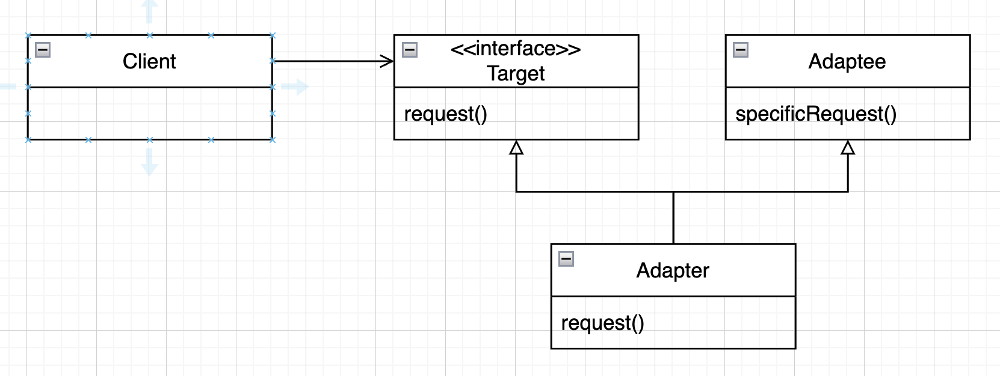

# Chapter7. 어댑터 패턴과 퍼사드 패턴

## 객체지향 어댑터

* 적용점
    * 업체가 변경되었는데, 기존 코드를 변경할 수 없을 때 적용
* 역할
    * 새 업체에서 사용하는 인터페이스를 기존에 사용하던 인터페이스에 적응 시켜주는 코드(어댑터)를 만들어 해결

### 코드

```java
public interface Duck {
    void quack();

    void fly();
}
```

```java
public class MallardDuck implements Duck {
    @Override
    public void quack() {
        System.out.println("Quack");
    }

    @Override
    public void fly() {
        System.out.println("I'm flying");
    }
}
```

```java
public interface Turkey {
    void gobble();

    void fly();
}
```

```java
public class WildTurkey implements Turkey {
    @Override
    public void gobble() {
        System.out.println("Gobble gobble");
    }

    @Override
    public void fly() {
        System.out.println("I'm flying a short distance");
    }
}
```

* Duck 객체가 부족하여 Turkey 객체를 사용해야 함
    * TurkeyAdapter: Turkey 를 사용하여 Duck 을 구현

```java
public class TurkeyAdapter implements Duck {
    private final Turkey turkey;

    public TurkeyAdapter(final Turkey turkey) {
        this.turkey = turkey;
    }

    @Override
    public void quack() {
        turkey.gobble();
    }

    @Override
    public void fly() {
        for (int i = 0; i < 5; i++) {
            turkey.fly();
        }
    }
}
```

* 테스트

```java

@Test
public void testTurkeyToDuck() {
    final var turkey = new WildTurkey();
    final var turkeyAdapter = new TurkeyAdapter(turkey);

    turkeyAdapter.quack();
    turkeyAdapter.fly();
}
```

```text
Gobble gobble
I'm flying a short distance
I'm flying a short distance
I'm flying a short distance
I'm flying a short distance
I'm flying a short distance
```

### 클라이언트에서 어댑터를 사용하는 방법

<p align="center">

1. 타겟 인터페이스를 사용하여 메소드를 호출함으로써 어댑터에 요청
2. 어댑터에서는 어댑터 인터페이스를 사용하여 그 요청을 어댑티에 대한 메소드 호출로 변환
3. 클라이언트에서는 호출 결과를 받긴하지만, 중간에 어댑터가 있는지 알지 못함

## 어댑터 패턴

> 한 클래스의 인터페이스를 클라이언트에서 사용하고자 하는 다른 이터페이스로 변환
> <br> 인터페이스 호환성 문제 때문에 같이 쓸 수 없는 클래스들을 연결해서 쓸 수 있음

### 클래스 다이어그램 - 객체 어댑터

<p align="center">

* 어댑티를 새로 바뀐 인터페이스로 감쌀 때 **객체 구성**을 사용 함
    * 어댑티의 서브클래스에서도 어댑터를 사용할 수 있음
* 특정 구현이 아닌 인터페이스에 클라이언트를 연결
    * 여러 어댑터 사용 가능
    * 나중에 다른 구현 추가 가능

### 클래스 다이어그램 - 클래스 어댑터

<p align="center">

* 어댑티를 적응 시키는데, 구성 대신 어댑터를 어댑티와 타겟 클래스 모두의 서브 클래스로 만들어 사용
    * 장점: 어댑티 전체를 다시 구현하지 않아도 된다. 어댑티의 행동을 오버라이드 할 수 있다.
    * 단점: 특정 어댑티 클래스에만 적용된다.
* 자바에서는 다중상속 지원 안하므로 사용 못함

### IteratorEnumeration

* Iterator to Enumeration

```java
public class IteratorEnumeration implements Enumeration {
    private final Iterator iterator;

    public IteratorEnumeration(final Iterator iterator) {
        this.iterator = iterator;
    }

    @Override
    public boolean hasMoreElements() {
        return iterator.hasNext();
    }

    @Override
    public Object nextElement() {
        return iterator.next();
    }
}
```

```java

@Test
void testIteratorToEnumeration() {
    final var list = Arrays.asList(1, 2, 3);
    final var enumeration = new IteratorEnumeration(list.stream().iterator());
    while (enumeration.hasMoreElements()) {
        System.out.println(enumeration.nextElement());
    }
}
```

### EnumerationIterator

* Enumeration to Iterator

```java
public class EnumerationIterator implements Iterator {
    private final Enumeration enumeration;

    public EnumerationIterator(final Enumeration enumeration) {
        this.enumeration = enumeration;
    }

    @Override
    public boolean hasNext() {
        return enumeration.hasMoreElements();
    }

    @Override
    public Object next() {
        return enumeration.nextElement();
    }
}
```

```java

@Test
void testEnumerationToIterator() {
    final var list = Arrays.asList(1, 2, 3);
    final var vector = new Vector<>(list);
    final var iterator = new EnumerationIterator(vector.elements());
    while (iterator.hasNext()) {
        System.out.println(iterator.next());
    }
}
```

## 퍼사드 패턴

> 어떤 서브 시스템의 일련의 인터페이스에 대한 통합된 인터페이스를 제공한다. 퍼사드에서 고수준 인터페이스를 정의하기 때문에 서브시스템을 더 쉽게 사용할 수 있다.

<p align="center">

* 어댑터 패턴: 한 인터페이스를 다른 인터페이스로 변환
* 퍼사드 패턴: 인터페이스를 단순화 하기 위해 인터페이스를 변경
* 데코레이터 패턴: 인터페이스는 바꾸지 않고, 책임(기능)만 추가

### 홈씨어터 퍼사드 구축

* 퍼사드

```java
public class HomeTheaterFacade {
    private final Amplifier amplifier;
    private final Tuner tuner;
    private final DvdPlayer dvdPlayer;
    private final CdPlayer cdPlayer;
    private final Projector projector;
    private final TheaterLights lights;
    private final Screen screen;
    private final PopcornPopper popper;

    public HomeTheaterFacade(final Amplifier amplifier,
                             final Tuner tuner,
                             final DvdPlayer dvdPlayer,
                             final CdPlayer cdPlayer,
                             final Projector projector,
                             final TheaterLights lights,
                             final Screen screen,
                             final PopcornPopper popper) {
        this.amplifier = amplifier;
        this.tuner = tuner;
        this.dvdPlayer = dvdPlayer;
        this.cdPlayer = cdPlayer;
        this.projector = projector;
        this.lights = lights;
        this.screen = screen;
        this.popper = popper;
    }

    public void watchMovie(final String movie) {
        System.out.println("Get ready to watch a movie...");
        popper.on();
        popper.pop();
        lights.dim(10);
        screen.down();
        projector.on();
        projector.wideScreenMode();
        amplifier.on();
        amplifier.setDvd(dvdPlayer);
        amplifier.setSurroundSound();
        amplifier.setVolume(5);
        dvdPlayer.on();
        dvdPlayer.play(movie);
    }

    public void endMovie() {
        System.out.println("Shutting movie theater down...");
        popper.off();
        lights.on();
        screen.up();
        projector.off();
        amplifier.off();
        dvdPlayer.stop();
        dvdPlayer.eject();
        dvdPlayer.off();
    }
}
```

* 클라이언트

```java

@Test
public void testFacade() {
    final var homeTheater = new HomeTheaterFacade(
            new Amplifier(),
            new Tuner(),
            new DvdPlayer(),
            new CdPlayer(),
            new Projector(),
            new TheaterLights(),
            new Screen(),
            new PopcornPopper()
    );

    homeTheater.watchMovie("Raiders of the Lost Ark");
    homeTheater.endMovie();

}
```

## 객체 지향 설계 원칙 - 최소 지식 원칙(= 데메테르의 법칙)

> 정말 친한 친구하고만 얘기하라

* 시스템을 디자인할 때, 상호작용하는 클래스의 개수에 주의해야 하며, 그럴 객체들과 어떤 식으로 상호작용 하는지에도 주의를 기울여야 한다.

### 가이드 라인

* 어떤 메소드에서든지 아래 네개의 객체의 메소드만 호출하면 된다.
    1. 객체 자체
    2. 메소드에 매개변수로 전달된 객체
    3. 그 메소드에서 생성하고 인스턴스를 만들 객체
    4. 그 객체에 속하는 구성요소
* 메소드를 호출해서 리턴받은 객체의 메소드를 호출할 때 문제점
    * 다른 객체와 알게 된다. -> 그 객체에서 대시 요청 하도록 만들어야 한다
  ```java
  // before
  public float getTemp() {
    Thermometer thermometer = station.getThermometer();
    return thermometer.getTemperature();
  }
  
  // after
  public float getTemp() {
    return station.getTemperature();
  }
  ```