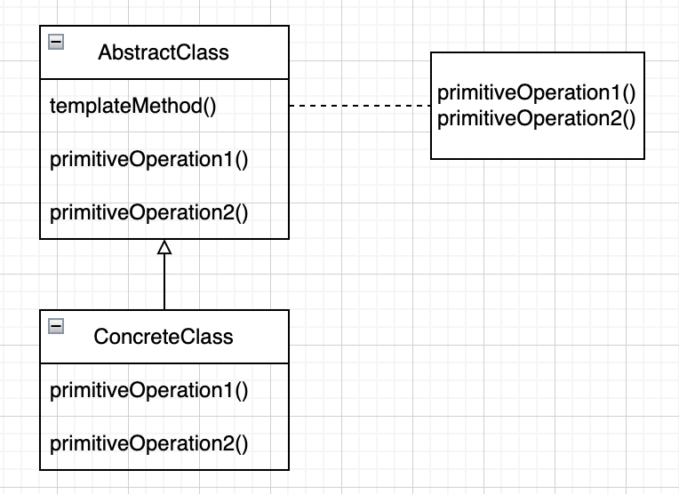
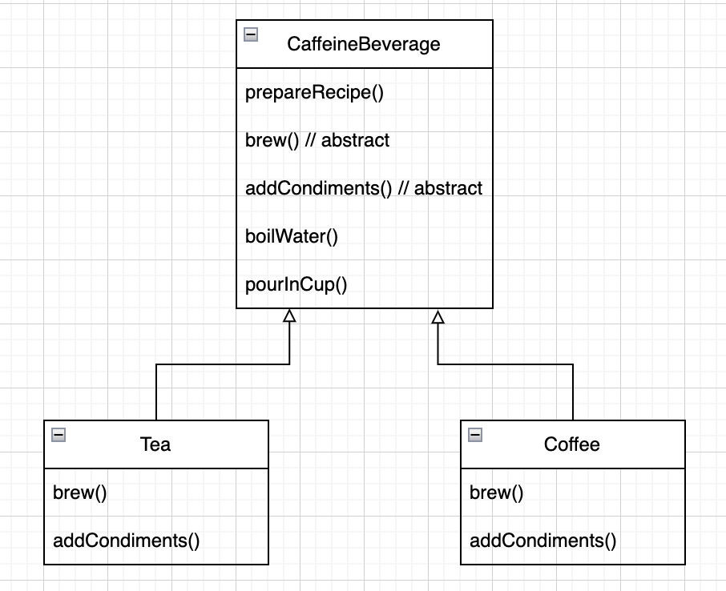

# Chapter8. 템플릿 메소드 패턴

* 학습목표
    * 알고리즘을 캡슐화해서, 서브클래스에서 언제든 필요할 때마다 가져다 쓸 수 있도록 만들기

## 템플릿 메소드

<p align="center">

> 메소드에서 알고리즘의 골격을 정의한다.
> 알고리즘의 여러 단계 중 일부는 서브클래스에서 구현할 수 있다.
> 템플릿 메소드를 이용하면 알고리즘의 구조는 그대로 유지하면서 서브클래스에서 특정 단계를 재정의할 수 있다.

### 예제 코드

<p align="center">

```java
public abstract class CaffeineBeverage {
    public final void prepareRecipe() {
        boilWater();
        brew();
        pourInCup();
        addCondiments();
    }

    abstract void brew();

    abstract void addCondiments();

    public void boilWater() {
        System.out.println("물 끓이는 중");
    }

    public void pourInCup() {
        System.out.println("컵에 물 따르는 중");
    }
}
```

```java
public class Tea extends CaffeineBeverage {
    @Override
    void brew() {
        System.out.println("차를 우려내는 중");
    }

    @Override
    void addCondiments() {
        System.out.println("레몬을 추가하는 중");
    }
}
```

```java
public class Coffee extends CaffeineBeverage {
    @Override
    void brew() {
        System.out.println("필터로 커피를 우려내는 중");
    }

    @Override
    void addCondiments() {
        System.out.println("설탕과 커피를 추가하는 중");
    }
}
```

```java

@Test
public void testCaffeineBeverage() {
    final CaffeineBeverage tea = new Tea();
    tea.prepareRecipe();

    final CaffeineBeverage coffee = new Coffee();
    coffee.prepareRecipe();
}
```

```text
물 끓이는 중
차를 우려내는 중
컵에 물 따르는 중
레몬을 추가하는 중
물 끓이는 중
필터로 커피를 우려내는 중
컵에 물 따르는 중
설탕과 커피를 추가하는 중
```

## 후크 구현

* 후크(hook): 추상 클래스에서 선언되는 메소드긴 하지만, 기본적인 내용만 구현되어 있거나 아무 코드도 들어있지 않은 메소드

### 예제코드

```java
public abstract class CaffeineBeverageWithHook {
    public final void prepareRecipe() {
        boilWater();
        brew();
        pourInCup();
        if (customerWantsCondiments()) {
            addCondiments();
        }
    }

    abstract void brew();

    abstract void addCondiments();

    public void boilWater() {
        System.out.println("물 끓이는 중");
    }

    public void pourInCup() {
        System.out.println("컵에 물 따르는 중");
    }

    boolean customerWantsCondiments() {
        return true;
    }
}
```

```java
public class CoffeeWithHook extends CaffeineBeverageWithHook {
    @Override
    void brew() {
        System.out.println("필터로 커피를 우려내는 중");
    }

    @Override
    void addCondiments() {
        System.out.println("설탕과 커피를 추가하는 중");
    }

    @Override
    boolean customerWantsCondiments() {
        final var answer = getUserInput();

        return answer.toLowerCase().startsWith("y");
    }

    private String getUserInput() {
        String answer = null;

        System.out.print("커피에 우유와 설탕을 넣어 드릴까요? (y/n): ");

        final var in = new BufferedReader(new InputStreamReader(System.in));

        try {
            answer = in.readLine();
        } catch (IOException e) {
            System.out.println("IO 오류!");
        }

        if (answer != null) {
            return "no";
        }

        return answer;
    }
}
```

### 후크에 관련 질문

* 언제 추상매소드와 후크를 사용해야 하나
    * 추상메소드: 서브클래스에서 알고리즘의 특정 단계를 제공해야만 하는 경우
    * 후크: 알고리즘의 특정 부분이 선택적으로 적용되는 경우
* 후크의 용도
    * 필수적이지 않은 부분을 필요에 따라 서브클래스에 구현
    * 전처리 후처리 기능
* 추상 메소드가 많아지면 구현하기 불편/복잡
* 추상 메소드가 너무 적으면 유연성이 떨어짐

## 일곱번째 객체지향 설계 원칙 - 헐리우드 원칙

> 먼저 연락하지 마세요. 저희가 연락 드리겠습니다.

* 이 원칙을 사용하면, "의존성 부패(dependency rot)"을 방지할 수 있음
    * 순환 참조 방지
* 고수준 구성요소에서 저수준 구성요소를 사용
* 할리우드 원칙이 적용된 패턴
    * 템플릿 메소드
    * 팩토리 메소드
    * 옵저버

### 할리우드 원칙에 관한 질문

* 할리우드 원칙, 의존성 뒤집기 원칙 관계
    * 의존성 뒤집기 원칙: 될 수 있으면 구상 클래스 사용을 줄이고, 대신 추상화된 것을 사용해야 한다.
    * 할리우드 원칙: 저수준 구성요소가 컴퓨테이션에 참여할 수는 있으면서도, 저수준 구성요소와 고수준 계층 사이에 의존성을 만들어내지 않도록 프레임워크 또는 구성요소를구축하기 위한 기법
    * 객체를 분리시킨다는 하나의 목표를 공유
    * 의존성 뒤집기 원칙이 훨씬 강하고 일반적인 내용을 담고 있다.
* 저수준 구서용소에서 고수준 구성요소에 있는 메소드를 호출할 순 없는가?
    * 그런건 아니지만, 순환 의존성은 피하는 것이 좋음
* 템플릿 메소드 패턴, 스트래티지 패턴, 팩토리 메소드 패턴 구분
    * 템플릿 메소드 패턴: 알고리즘의 일부 단계를 구현하는 것을 서브클래스에서 처리
    * 스트래티지 패턴: 바꿔 쓸 수 있는 행동을 캡슐화 하고 어떤 행동을 사용할지는 서브클래스에 맡김
    * 팩토리 메소드 패턴: 어떤 구상 클래스를 생성할지를 서브클래스에서 결정

## 템플릿 메소드 패턴이 사용되는 예

### 정렬

