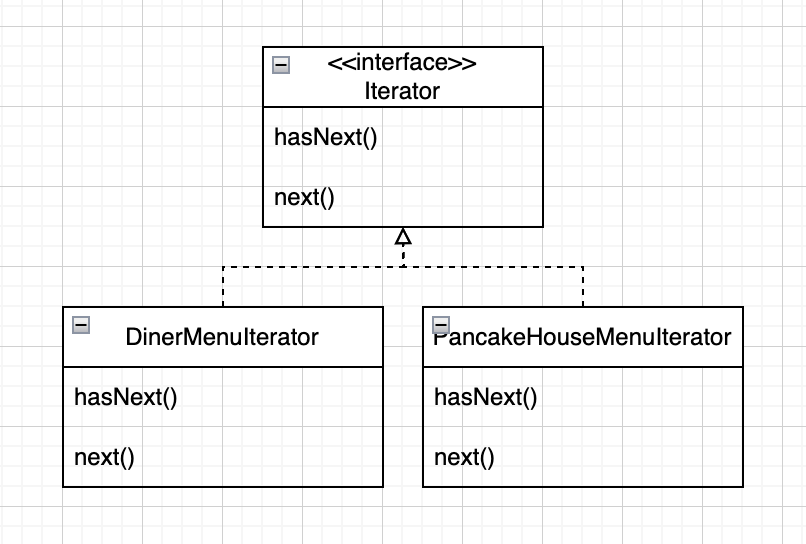
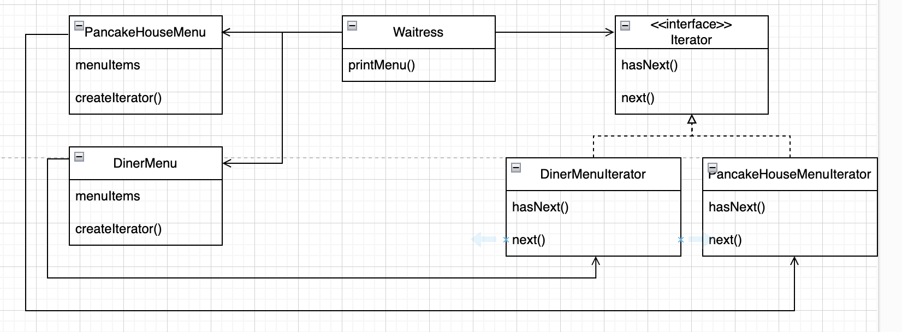
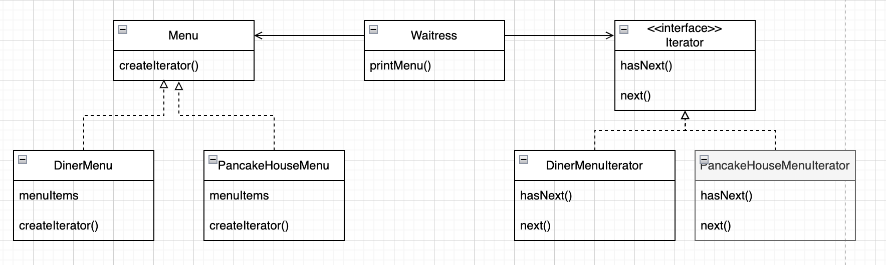
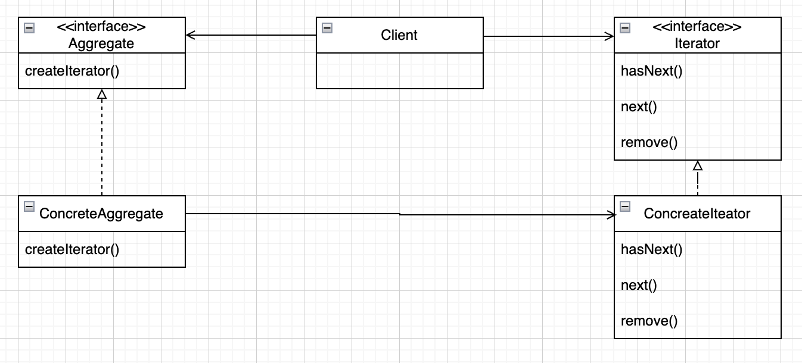
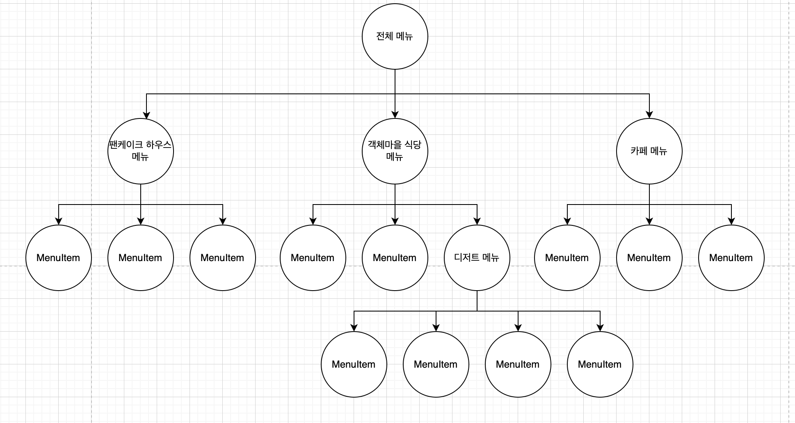
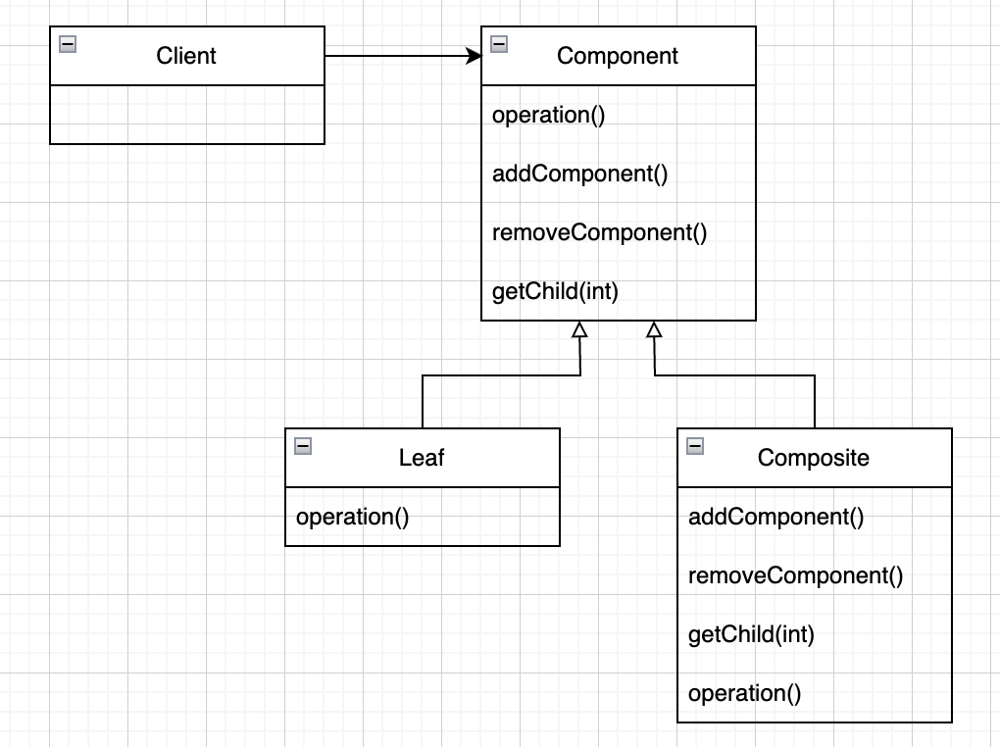

# 이터레이터와 컴포지트 패턴
* 학습목표
  * 이터레이터 패턴
    * 객체를 컬렉션에 집어 넣는 방법: 배열, 스택, 해시테이블 ...
    * 클라이언트에서 컬렉션 안에 있는 객체들에 접근하는 작업을 할 때, 객체럴 저장하는 방식을 보여주지 않으면서도 접근할 수 있게 하는 방법
  * 컴포지트 패턴
    * 한방에 자료 구조로 변신할 수 있는 객체들로 구성된 수퍼 컬렉션

## 객체 마을식당, 객체마을 팬케이크 하우스 합병
### 합의 본 메뉴 코드
```java
public class MenuItem {
    private final String name;
    private final String description;
    private final boolean vegetarian;
    private final double price;

    public MenuItem(final String name,
                    final String description,
                    final boolean vegetarian,
                    final double price) {
        this.name = name;
        this.description = description;
        this.vegetarian = vegetarian;
        this.price = price;
    }

    public String getName() {
        return name;
    }

    public String getDescription() {
        return description;
    }

    public boolean isVegetarian() {
        return vegetarian;
    }

    public double getPrice() {
        return price;
    }
}
```

### 객체마을 팬케이크 하우스의 구현 - ArrayList 사용
```java
public class PancakeHouseMenu {
    private final List<MenuItem> menuItems;

    public PancakeHouseMenu() {
        menuItems = new ArrayList<>();
        addItem("K&B 팬케이크 세트", "스크램블드 에그와 토스트가 곁들여진 팬케이크", true, 2.99);
        addItem("레귤러 팬케이크", "달걀 후리아와 소시지가 곁들여진 팬케이크", false, 2.99);
        addItem("블루베리 팬케이크", "신선한 블루베리와 블루베리 시럽으로 만든 팬케이크", true, 3.49);
        addItem("와플", "와플, 취향에 따라 블루베리나 딸기를 얹을 수 있습니다.", false, 3.59);
    }

    private void addItem(final String name,
                         final String description,
                         final boolean vagetarian,
                         final double price) {
        final var menuItem = new MenuItem(name, description, vagetarian, price);
        menuItems.add(menuItem);
    }

    public List<MenuItem> getMenuItems() {
        return menuItems;
    }
}
```
### 객체마을 식당의 구현 - array 사용
```java
public class DinnerMenu {
    private static final int MAX_ITEMS = 6;
    private final MenuItem[] menuItems;
    private int numberOfItems = 0;

    public DinnerMenu() {
        menuItems = new MenuItem[MAX_ITEMS];
        addItem("채식주의자용 BLT", "통밀 위에(식물성) 베이컨, 상추, 토파토를 얹은 메뉴", true, 2.99);
        addItem("BLT", "통밀 위에 베이컨, 상추, 토마토를 얹은 메뉴", false, 2.99);
        addItem("오늘의 스프", "감자 샐러드르 ㄹ곁들인 오늘의 스프", false, 3.29);
        addItem("핫도그", "사워크라우트, 갖은 양념, 양파, 치즈가 곁들여진 핫도그", false, 3.05);
    }

    private void addItem(final String name,
                         final String description,
                         final boolean vagetarian,
                         final double price) {
        final var menuItem = new MenuItem(name, description, vagetarian, price);

        if (numberOfItems >= MAX_ITEMS) {
            System.err.println("죄송합니다, 메뉴가 꽉 찼습니다. 더 이상 추가할 수 없습니다.");
        } else {
            menuItems[numberOfItems] = menuItem;
            numberOfItems += 1;
        }
    }
}
```

### 웨이트리스 구현

```java
import main.java.com.example.designpatterns.chp9_iterator_and_composite.iterator.DinnerMenu;
import main.java.com.example.designpatterns.chp9_iterator_and_composite.iterator.PancakeHouseMenu;

public void printMenu() {
  final var pancakeHouseMenu = new PancakeHouseMenu();
  final var breakfastItems = pancakeHouseMenu.getMenuItems();

  final var dinerMenu = new DinnerMenu();
  final var lunchItems = dinerMenu.getMenuItems();

  for (MenuItem breakfastItem : breakfastItems) {
    System.out.print(breakfastItem.getName() + "  ");
    System.out.println(breakfastItem.getPrice());
    System.out.println(breakfastItem.getDescription());
  }

  for (int i = 0; i < lunchItems.length; i++) {
    final var lunchItem = lunchItems[i];
    System.out.print(lunchItem.getName() + "  ");
    System.out.println(lunchItem.getPrice());
    System.out.println(lunchItem.getDescription());
  }
}
```
* 문제점
  * 구상 클래스에 맞춰서 코딩하고 있다.
  * DinnerMenu를 사용하는 방식에서 메뉴항목의 목록을 HashTable로 변경하려면 Waitress의 코드를 변경해야 한다.
  * Waitress 에서 메뉴항목의 컬렉션을 표현하는 방법을 알아야 한다.
    * 캡슐화 위반
  * 코드 종복

## 반복을 캡슐화
### 기존 코드
```java
// Waitress.java
public void printMenu() {
    // ArrayList의 size(), get() 사용
    for (int i = 0; i < breakfastItems.size(); i++) {
        MenuItem menuItem = (MenuItem) breakfastItems.get(i);
        // ...
    }

    // 배열의 length, 배열 첨자 이용
    for (int i = 0; i < lunchItems.lengh; i++) {
        MenuItem menuItem = lunchItems[i];
        // ...
    }
}
```

### 이터레이터 패턴 적용
* 반복작업 캡슐화
<p align="center">

* Iterator 인터페이스 정의
```java
public interface Iterator {
    boolean hasNext();

    Object next();
}
```

* DinnerMenuIterator 구현
```java
public class DinnerMenuIterator implements Iterator {
    private final MenuItem[] menuItems;
    private int position = 0;

    public DinnerMenuIterator(final MenuItem[] menuItems) {
        this.menuItems = menuItems;
    }

    @Override
    public boolean hasNext() {
        return menuItems != null && position < menuItems.length && menuItems[position] != null;
    }

    @Override
    public Object next() {
        final var menuItem = menuItems[position];
        position += 1;
        return menuItem;
    }
}
```

* DinerMenu 에 Iterator 추가
```java
public class DinnerMenu {
    private static final int MAX_ITEMS = 6;
    private final MenuItem[] menuItems;
    private int numberOfItems = 0;

    public DinnerMenu() {
        menuItems = new MenuItem[MAX_ITEMS];
        addItem("채식주의자용 BLT", "통밀 위에(식물성) 베이컨, 상추, 토파토를 얹은 메뉴", true, 2.99);
        addItem("BLT", "통밀 위에 베이컨, 상추, 토마토를 얹은 메뉴", false, 2.99);
        addItem("오늘의 스프", "감자 샐러드르 ㄹ곁들인 오늘의 스프", false, 3.29);
        addItem("핫도그", "사워크라우트, 갖은 양념, 양파, 치즈가 곁들여진 핫도그", false, 3.05);
    }

    private void addItem(final String name,
                         final String description,
                         final boolean vagetarian,
                         final double price) {
        final var menuItem = new MenuItem(name, description, vagetarian, price);

        if (numberOfItems >= MAX_ITEMS) {
            System.err.println("죄송합니다, 메뉴가 꽉 찼습니다. 더 이상 추가할 수 없습니다.");
        } else {
            menuItems[numberOfItems] = menuItem;
            numberOfItems += 1;
        }
    }

    public Iterator createIterator() {
        return new DinnerMenuIterator(menuItems);
    }
}
```
* Waitress 코드 고치기
  - 메뉴구현법이 캡슐화 됨,
    - waitress 의 입장에서는 메뉴에서 메뉴 항목의 컬렉션을 어떤 식으로 저장하는지 알 수 없음
    - waitress 는 인터페이스(iterator)만 알고 있으면 됨
  - 여전히 구상 클래스(PancakeHouseMenu, DinerMenu)에 묶여 있음
    - TODO: 고처야 함
```java
public class Waitress {
    private final PancakeHouseMenu pancakeHouseMenu;
    private final DinnerMenu dinnerMenu;

    public Waitress(final PancakeHouseMenu pancakeHouseMenu,
                    final DinnerMenu dinnerMenu) {
        this.pancakeHouseMenu = Objects.requireNonNull(pancakeHouseMenu);
        this.dinnerMenu = Objects.requireNonNull(dinnerMenu);
    }

    public void printMenu() {
        final var pancakeIterator = pancakeHouseMenu.createIterator();
        final var dinnerIterator = dinnerMenu.createIterator();

        System.out.println("아침 메뉴");
        printMenu(pancakeIterator);

        System.out.println("점심 메뉴");
        printMenu(dinnerIterator);
    }

    private void printMenu(final Iterator iterator) {
        while (iterator.hasNext()) {
            final MenuItem menuItem = (MenuItem) iterator.next();
            System.out.print(menuItem.getName() + ", ");
            System.out.print(menuItem.getPrice() + ", -- ");
            System.out.println(menuItem.getDescription());
        }
    }
}
```
* 테스트
```java
@Test
public void testIterator() {
    final var pancakeHouseMenu = new PancakeHouseMenu();
    final var dinnerMenu = new DinnerMenu();

    final var waitress = new Waitress(pancakeHouseMenu, dinnerMenu);
    waitress.printMenu();
}
```

* 결과
```text
아침 메뉴
K&B 팬케이크 세트, 2.99, -- 스크램블드 에그와 토스트가 곁들여진 팬케이크
레귤러 팬케이크, 2.99, -- 달걀 후리아와 소시지가 곁들여진 팬케이크
블루베리 팬케이크, 3.49, -- 신선한 블루베리와 블루베리 시럽으로 만든 팬케이크
와플, 3.59, -- 와플, 취향에 따라 블루베리나 딸기를 얹을 수 있습니다.
점심 메뉴
채식주의자용 BLT, 2.99, -- 통밀 위에(식물성) 베이컨, 상추, 토파토를 얹은 메뉴
BLT, 2.99, -- 통밀 위에 베이컨, 상추, 토마토를 얹은 메뉴
오늘의 스프, 3.29, -- 감자 샐러드르 ㄹ곁들인 오늘의 스프
핫도그, 3.05, -- 사워크라우트, 갖은 양념, 양파, 치즈가 곁들여진 핫도그
```

* 클래드 다이어그램
<p align="center">

### 인터페이스 개선
* 직접 작성한 Iterator를 java.util.Iterator로 변경
* 클래스 다이어그램
<p align="center">

* PancakeHouseMenuIterator 삭제
* DinerMenuIterator 수정
```java
public class DinnerMenuIterator implements Iterator {
    private final MenuItem[] menuItems;
    private int position = 0;

    public DinnerMenuIterator(final MenuItem[] menuItems) {
        this.menuItems = menuItems;
    }

    @Override
    public boolean hasNext() {
        return menuItems != null && position < menuItems.length && menuItems[position] != null;
    }

    @Override
    public Object next() {
        final var menuItem = menuItems[position];
        position += 1;
        return menuItem;
    }

    @Override
    public void remove() {
        if (position <= 0) {
            throw new IllegalStateException("next()를 한번도 호출하지 않은 상태에서는 삭제할 수 없습니다.");
        }

        if (menuItems[position - 1] != null) {
            for (int i = position - 1; i < menuItems.length - 1; i++) {
                menuItems[i] = menuItems[i + 1];
            }
            menuItems[menuItems.length - 1] = null;
        }
    }
}
```
* Menu 인터페이스 추가
```java
public interface Menu {
    Iterator createIterator();
}
```
* PancakeHouseMenu, DinerMenu 수정
  * Iterator 를 java.util.Iterator 로 변경
  * Menu 를 구현하도록 변경
* Waitress 수정
```java
public class Waitress {
    private final Menu pancakeHouseMenu;
    private final Menu dinnerMenu;

    public Waitress(final Menu pancakeHouseMenu,
                    final Menu dinnerMenu) {
        this.pancakeHouseMenu = Objects.requireNonNull(pancakeHouseMenu);
        this.dinnerMenu = Objects.requireNonNull(dinnerMenu);
    }

    public void printMenu() {
        final var pancakeIterator = pancakeHouseMenu.createIterator();
        final var dinnerIterator = dinnerMenu.createIterator();

        System.out.println("아침 메뉴");
        printMenu(pancakeIterator);

        System.out.println("점심 메뉴");
        printMenu(dinnerIterator);
    }

    private void printMenu(final Iterator iterator) {
        while (iterator.hasNext()) {
            final MenuItem menuItem = (MenuItem) iterator.next();
            System.out.print(menuItem.getName() + ", ");
            System.out.print(menuItem.getPrice() + ", -- ");
            System.out.println(menuItem.getDescription());
        }
    }
}
```

## 이터레이터 패턴
> 컬렉션 구현 방법을 노출시키지 않으면서도
> 그 집합체 안에 들어있는 모든 항목에 접근할 수 있게 해 주는 방법을 제공

* 집합체 내에서 어떤식으로 일이 처리되는지에 대해서는 모르는 샅태에서 그 안에 모든 항목에 대한 반복작업을 처리
  * 캡슐화
* 모든 항목에 접근하는 작업을 컬렉션 객체가 아니라 반복자 객체에서 처리
  * 집합체의 인터페이스 및 구현이 간단해 짐

### 클래스 다이어그램
<p align="center">

### 이터레이터 패턴 관련 질문
* 내부반복자 vs 외부 반복자
  * 외부반복자: 클라이언트가 반복작업을 제어 - 클라이언트에서 next()를 호출하여 다음 항목을 가져옴
  * 내부반복자: 반복자 자신에 의해 제어 - 클라이언트가 작업을 넘겨 주어야 한다.
    * 유연성이 떨어짐
    * 외부에서 사용하기가 편리
* Enumeration 인터페이스
  * 예전에 Iterator 용도로 사용
  * hasNext() -> hasMoreElements()
  * next() -> nextElement()

## 객체지향 원칙 - 단일 역할 원칙
> 클래스를 바꾸는 이유는 한가지 뿐이어야 한다.

* 응집도: 한 클래스 또는 모듈이 특정 목적 또는 역할을 얼마나 일관되게 지원하는지를 나타내는 척도

## 객체마을 카페 합병

## 컴포지트 패턴

> 객체들을 트리 구조로 구성하여
> 부분과 전체를 나타내는 계층 구주로 만들 수 있다.
> <br> 이 패턴을 이용하면, 클라이언트에서 개별 객체와 다른 객체들로 구성된 복합 객체를 똑같은 방법으로 다룰 수 있다.

<p align="center">

* 컴포지트 패턴을 이용하면, 객체의 구성과 개별 객체를 노드로 가지는 트리 형태로 객체를 구축
* 이른 복합 구조를 사용하면, 복합 객체와 개별 객체에 대해 똑같은 작업을 적용할 수 있음

### 클래스 다이어그램

<p align="center">

* Client
  * Component 인터페이스를 이용하여 복합 객체 내의 객체들을 조작할 수 있다.
* Component
  * 복합 객체 내에 들어있는 모든 객첻들에 대한 인터페이스를 정의
  * 복합 노드 뿐 아니라 리프 노드에 대한 메소드까지 정의
  * add(), remove(), getChild() 등 몇가지 작업에 대해서 기본행동 정의 하라 수 있음
* Composite
  * 자식이 있는 구성 요소의 행동들을 정의하고, 자식구성요소를 저장하는 역할
  * 리프와 관련된 기능도 구현해야 함
    * 보통 쓸모가 없지만 예외라도 던져야 함
* Leaf
  * 해당 원소에 대한 행동응ㄹ 정의
  * Composite에서 지원하는 기능을 구현

### 예제코드

* MenuComponent 인터페이스
  * MenuItem, Menu 에서 MenuComponent 의 구현체를 구현해야 하는데 각각 역할이 다르기 때문에, 자기 역할에 맞지 않는 상황에는 예외를 던지는 코드를 기본 구현으로 제공

```java
public abstract class MenuComponent {
  public void add(MenuComponent menuComponent) {
    throw new UnsupportedOperationException();
  }

  public void remove(MenuComponent menuComponent) {
    throw new UnsupportedOperationException();
  }

  public MenuComponent getChild(int i) {
    throw new UnsupportedOperationException();
  }

  public String getName() {
    throw new UnsupportedOperationException();
  }

  public String getDescription() {
    throw new UnsupportedOperationException();
  }

  public double getPrice() {
    throw new UnsupportedOperationException();
  }

  public boolean isVegetarian() {
    throw new UnsupportedOperationException();
  }

  public void print() {
    throw new UnsupportedOperationException();
  }
}
```

* MenuItem
  * Leaf 노드
  * 행동을 구현해야 한다.

```java
public class MenuItem extends MenuComponent {
  private final String name;
  private final String description;
  private final boolean vegetarian;
  private final double price;

  public MenuItem(final String name,
                  final String description,
                  final boolean vegetarian,
                  final double price) {
    this.name = name;
    this.description = description;
    this.vegetarian = vegetarian;
    this.price = price;
  }

  @Override
  public String getName() {
    return name;
  }

  @Override
  public String getDescription() {
    return description;
  }

  @Override
  public boolean isVegetarian() {
    return vegetarian;
  }

  @Override
  public double getPrice() {
    return price;
  }

  @Override
  public void print() {
    System.out.print(" " + getName());

    if (isVegetarian()) {
      System.out.print("(v)");
    }

    System.out.println(", " + getPrice());
    System.out.println("   -- " + getDescription());
  }
}
```

* Menu 구현

```java
public class Menu extends MenuComponent {
  private final List<MenuComponent> menuComponents;
  private final String name;
  private final String description;

  public Menu(final String name,
              final String description) {
    this.menuComponents = new ArrayList<>();
    this.name = name;
    this.description = description;
  }

  @Override
  public void add(MenuComponent menuComponent) {
    menuComponents.add(menuComponent);
  }

  @Override
  public void remove(MenuComponent menuComponent) {
    menuComponents.remove(menuComponent);
  }

  @Override
  public MenuComponent getChild(int i) {
    return menuComponents.get(i);
  }

  @Override
  public String getName() {
    return name;
  }

  @Override
  public String getDescription() {
    return description;
  }

  @Override
  public void print() {
    System.out.print("\n" + getName());
    System.out.println(", " + getDescription());
    System.out.println("---------------------");

    final var iterator = menuComponents.iterator();

    while (iterator.hasNext()) {
      final var menuComponent = iterator.next();
      menuComponent.print();
    }
  }
}
```

* Waitress 구현

```java
public class Waitress {
  private final MenuComponent allMenus;

  public Waitress(final MenuComponent allMenus) {
    this.allMenus = Objects.requireNonNull(allMenus);
  }

  public void printMenu() {
    allMenus.print();
  }
}
```

* 테스트 코드

```java

@Test
public void testWaitress() {
  final var pancakeHouseMenu = new Menu("팬케이크 하우스 메뉴", "아침 메뉴");
  pancakeHouseMenu.add(new MenuItem("K&B 팬케이크 세트", "스크램블드 에그와 토스트가 곁들여진 팬케이크", true, 2.99));
  pancakeHouseMenu.add(new MenuItem("레귤러 팬케이크", "달걀 후리아와 소시지가 곁들여진 팬케이크", false, 2.99));
  pancakeHouseMenu.add(new MenuItem("블루베리 팬케이크", "신선한 블루베리와 블루베리 시럽으로 만든 팬케이크", true, 3.49));
  pancakeHouseMenu.add(new MenuItem("와플", "와플, 취향에 따라 블루베리나 딸기를 얹을 수 있습니다.", false, 3.59));

  final var desertMenu = new Menu("디저트 메뉴", "디저트를 즐겨보세요!");
  desertMenu.add(new MenuItem("애플 파이", "바삭바삭한 크러스트에 바닐라 아이스크림이 얹혀 있는 애플 파이", true, 1.59));

  final var dinerMenu = new Menu("객체마을 식당 메뉴", "점심 메뉴");
  dinerMenu.add(new MenuItem("채식주의자용 BLT", "통밀 위에(식물성) 베이컨, 상추, 토파토를 얹은 메뉴", true, 2.99));
  dinerMenu.add(new MenuItem("BLT", "통밀 위에 베이컨, 상추, 토마토를 얹은 메뉴", false, 2.99));
  dinerMenu.add(new MenuItem("오늘의 스프", "감자 샐러드르 ㄹ곁들인 오늘의 스프", false, 3.29));
  dinerMenu.add(new MenuItem("핫도그", "사워크라우트, 갖은 양념, 양파, 치즈가 곁들여진 핫도그", false, 3.05));
  dinerMenu.add(desertMenu);

  final var cafeMenu = new Menu("카페 메뉴", "저녁 메뉴");
  cafeMenu.add(new MenuItem("베지 버거와 에어 프라이", "통밀빵, 상추, 토마토, 감자튀김이 첨가된 베지 보거", true, 3.99));
  cafeMenu.add(new MenuItem("오늘의 스프", "샐러드가 곁들여진 오늘의 스프", false, 3.69));
  cafeMenu.add(new MenuItem("베리또", "통 핀토콩과 살사, 구아카몰이 곁들여진 푸짐한 베리또", true, 4.29));

  final var allMenus = new Menu("전체 매뉴", "전체 메뉴");
  allMenus.add(pancakeHouseMenu);
  allMenus.add(dinerMenu);
  allMenus.add(cafeMenu);

  final var waitress = new Waitress(allMenus);
  waitress.printMenu();
}
```

* 결과

```text
전체 매뉴, 전체 메뉴
---------------------

팬케이크 하우스 메뉴, 아침 메뉴
---------------------
 K&B 팬케이크 세트(v), 2.99
   -- 스크램블드 에그와 토스트가 곁들여진 팬케이크
 레귤러 팬케이크, 2.99
   -- 달걀 후리아와 소시지가 곁들여진 팬케이크
 블루베리 팬케이크(v), 3.49
   -- 신선한 블루베리와 블루베리 시럽으로 만든 팬케이크
 와플, 3.59
   -- 와플, 취향에 따라 블루베리나 딸기를 얹을 수 있습니다.

객체마을 식당 메뉴, 점심 메뉴
---------------------
 채식주의자용 BLT(v), 2.99
   -- 통밀 위에(식물성) 베이컨, 상추, 토파토를 얹은 메뉴
 BLT, 2.99
   -- 통밀 위에 베이컨, 상추, 토마토를 얹은 메뉴
 오늘의 스프, 3.29
   -- 감자 샐러드르 ㄹ곁들인 오늘의 스프
 핫도그, 3.05
   -- 사워크라우트, 갖은 양념, 양파, 치즈가 곁들여진 핫도그

디저트 메뉴, 디저트를 즐겨보세요!
---------------------
 애플 파이(v), 1.59
   -- 바삭바삭한 크러스트에 바닐라 아이스크림이 얹혀 있는 애플 파이

카페 메뉴, 저녁 메뉴
---------------------
 베지 버거와 에어 프라이(v), 3.99
   -- 통밀빵, 상추, 토마토, 감자튀김이 첨가된 베지 보거
 오늘의 스프, 3.69
   -- 샐러드가 곁들여진 오늘의 스프
 베리또(v), 4.29
   -- 통 핀토콩과 살사, 구아카몰이 곁들여진 푸짐한 베리또
```

### 질문

* 한 클래스가 두가지 역할을 수행하는 것은 아닌가?
  * 맞음. 컴포지트 패턴에서는 단일 역할 원칙을 깨면서, 대신에 투명성을 확보하기 위한 패턴
  * 투명성(transparency): Component 인터페이스에 자식들을 관리하는 기능과 Leaf로써의 기능을 둘 다 집어 넣어 클라이언트에서 복합객체와 리프 노드를 똑같은 방식으로 처리할 수 있도록 했음
  * 클라이언트 입장에서는 어떤 원소가 복합객체인지 리프노드이닞 알 필요 없음ㄹ
  * 여러 역할을 다른 인터페이스로 설계할 수도 있지만
    * 코드에서 instanceof, 조건문 같은 연산자를 써야 함

## 컴포지트 패턴 내 이터레이터 추가

* 복합객체 전체에 대해서 반복작업을 수행해야 할 때 필요
* ex) 채식주의자용 메뉴항목 필터링 등

### MenuComponent 에 createIterator() 추가

```java
public abstract class MenuComponent {
  //... 

  public Iterator createIterator() {
    throw new UnsupportedOperationException();
  }
}
```

```java
public class Menu extends MenuComponent {
  // ...

  @Override
  public Iterator createIterator() {
    return new CompositeIterator(menuComponents.iterator());
  }
}
```

```java
public class MenuItem extends MenuComponent {
  // ...

  @Override
  public Iterator createIterator() {
    return new NullIterator();
  }
}
```

### 복합 반복자 - CompositeIterator

* CoompositeIterator
  * 복합객체 안에 들어 있는 MenuItem 에 대해 반복작업을 할 수 있게 해주는 기능을 제공

```java
public class CompositeIterator implements Iterator {
  private final Stack iteratorStack;

  // 최상위 복합 객체의 반복자가 매개변수로 전달 됨
  public CompositeIterator(final Iterator<MenuComponent> iterator) {
    iteratorStack = new Stack();
    iteratorStack.push(iterator);
  }

  @Override
  public boolean hasNext() {
    if (iteratorStack.isEmpty()) { // 스택이 비어있으면
      return false; // 다음 원소는 없다.
    } else { // 스택이 비어있지 않으면
      final var iterator = (Iterator) iteratorStack.peek(); // 최신 반복자를 꺼내서
      if (!iterator.hasNext()) { // 다음 원소가 없으면
        iteratorStack.pop(); // 이터레이터를 스택에서 꺼내고
        return hasNext();
      } else { // 다음 원소가 있으면
        return true;
      }
    }
  }

  @Override
  public Object next() {
    if (hasNext()) { // 다음 원소가 남아 있으면
      final var iterator = (Iterator) iteratorStack.peek(); // 최산 반복자를 꺼내서
      final var component = iterator.next(); // 다음 값을 꺼내오고

      if (component instanceof Menu) { // 다음 값이 메뉴이면
        iteratorStack.push(((Menu) component).createIterator()); // 이터레이터 스택에 넣고
      }
      return component; // 리턴
    } else { // 다음 원소가 남아 있지 않으면
      return null;
    }
  }

  @Override
  public void remove() {
    throw new UnsupportedOperationException();
  }
}
```

* MenuComponent#print()
  * 내부 반복자 사용해서 반복작업을 처리
* CompositeIterator
  * 외부 반복자 사용해서 반복작업을 처리

### 널 반복자 - NullIterator

* 리프 노드에 대한 iterator 를 위해 NullIterator 추가
* 널 객체 디자인 패턴 적용
* 아무일도 하지 않는 반복자

```java
public class NullIterator implements Iterator {
  @Override
  public boolean hasNext() {
    return false;
  }

  @Override
  public Object next() {
    return null;
  }

  @Override
  public void remove() {
    throw new UnsupportedOperationException();
  }
}
```

### Waitress#printVegetarianMenu() - 채식주의자용 메뉴 추가

```java
public void printVegetarianMenu() {
  final var iterator = allMenus.createIterator();

  System.out.println("\nVEGETARIAN MENU\n----------");

  while (iterator.hasNext()) {
    final var menuComponent = (MenuComponent) iterator.next();
    try {
      if (menuComponent.isVegetarian()) {
        menuComponent.print();
      }
    } catch (UnsupportedOperationException e) {
    }
  }
}
```

* try/catch는 오류를 처리 하기 위해 만들어 진건데, 위에 경우 사용하는게 맞나?
  * instanceof로 확인하고 캐스팅 할 수 있음 -> 투명성을 잃게 됨(Menu, MenuItem을 똑같이 다루지 않는 것)
  * Menu#isVegetarian()에서 false 리턴 -> 방법이 될 수 있음
  * 하지만, 여기서는 Menu#isVagetarian()이 지원되지 않는 다는 걸 명확하게 하기 위해 이런 방법을 사용

## 기타

* 컴포지트 패턴
  * 부분-전체 관계를 가진 컬렉션이 있고, 그 객체들을 모두 똑같은 방식으로 사용하고 싶을 때 사용하는 패턴
  * 부분-전체 관계 - 트리
    * 복합 객체: 다른 구성요소를 포함하고 있는 구성요소
    * 리프 객체: 다른 구성요소를 포함하지 않는 구성요소
  * 모든 객체의 인터페이스가 똑같아야 함
  * 객체에 따라서 필요 없는 메소드의 처리 방법
    * false or null 리턴
    * 예외를 던짐 -> 클라이언트에서 예외를 처리해야 함
  * 트리 내에서 돌아다니기 편하게 하기 위해, 혹은 삭제를 편리하게 하기 위해
    * 자식에 부모 노드에 대한 포인터를 넣을 수도 있음
  * 필요할 경우, 자식 노드의 순서도 고려해 봐야 함
  * 복합구조가 복잡하거나 복합객체를 한바퀴 도는데 많은 자원이 필요한 경우, 복합노드 캐싱이 도움이 된다.
  * 가장 큰 장점
    * 클라이언트를 단순화 - 클라이언트는 복합객체를 사용하는지 잎 객체를 사용하는지 신경쓰지 않아도 된다.

* 패턴
  * 클라이언트에서 객체 컬렉션과 개별 객체를 똑같은 방식으로 처리할 수 있다. - 컴포지트 패턴
  * 컬렉션의 구현을 드러내지 않으면서도 컬렉션에 있는 모든 객체들에 대해 반복작업을 할 수 있다. - 이터레이터 패턴
  * 일련의 클래스들에 대한 인터페이스를 단순화 시킨다. - 퍼사드 패턴
  * 하나 이상의 클래스의 인터페이스를 변환한다. - 어답터 패턴
  * 어떤 상태가 변경되었을 때, 일련의 객체들에게 연락할 수 있다. - 옵저버 패턴
  * 어떤 상태가 바뀜에 따라 객체의 행동을 바꿀 수 있다. - 스테이트 패턴


