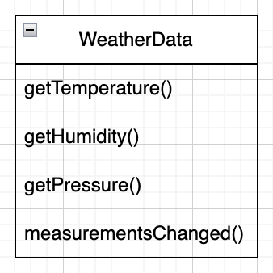
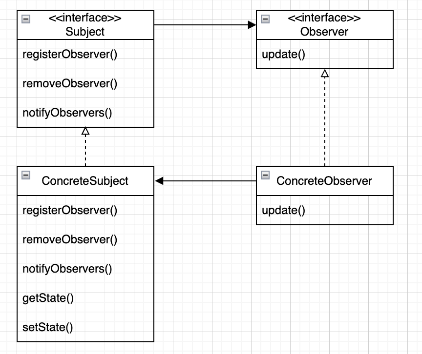
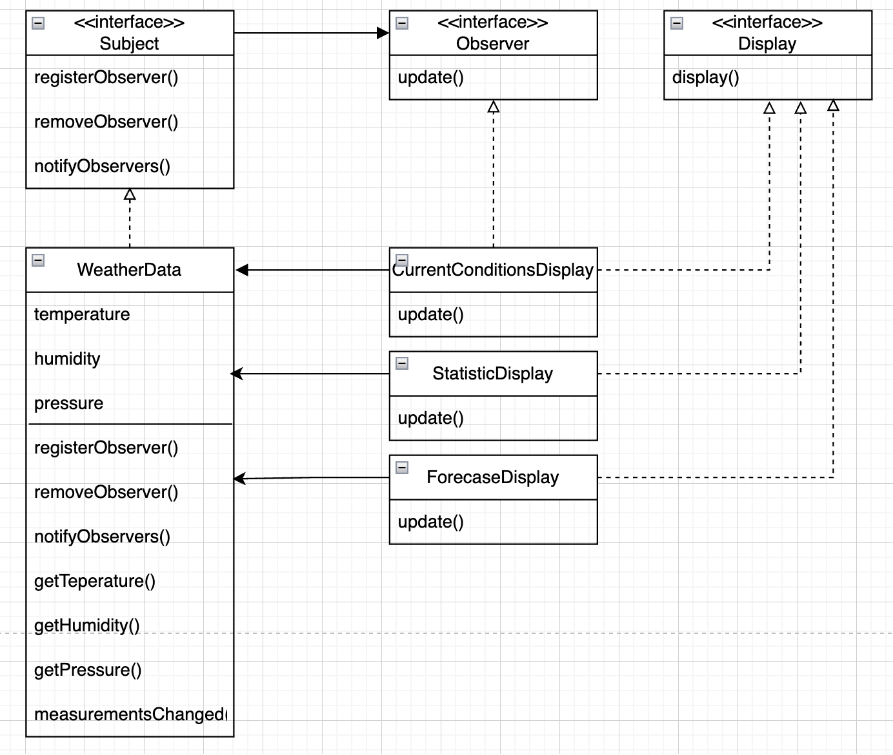

# 2. 옵저버 패턴

## 기상 모니터링 애플리케이션

* 기상 스테이션: 실제 기상 정보를 수집하는 장비
* WeatherData 객체: 기상 스테이션으로부터 오는 데이터를 추적하는 객체
* 디스플레이: 사용자에게 현재 기상 조건을 보여주는 디스플레이

## WeatherData 클래스

<p align="center">

* get...: 기상 스테이션에서 갱신된 정보를 가져오는것(out of scope)
* measurementsChanged()
    - 기상 관측값이 갱신될 떄마다 알려주기 위한 메서드
    - 현재 조건, 기상 통계, 기상 예측 이렇게 세가지 디스플레이를 갱신할 수 있도록 구현해야 함
    - 디스플레이는 추가/제거 될 수 있다.

```java
public class WeatherData {
    float temp = getTemperature();
    float humidity = getHumidity();
    float pressure = getPressure();

    // 캡슐화 해야 함
    currentConditionsDisplay.update(temp,humidity,pressure);
    statisticsDisplay.update(temp,humidity,pressure);
    forecastDisplay.update(temp,humidity,pressure);
}
```

* 위 코드의 문제점
    * 인터페이스가 아닌 구체적인 구현을 바탕으로 코딩하고 있다.
    * 새로운 디스플레이 항목이 추가될 때마다 코드를 변경해야 한다.
    * 실행 중에 디스플레이 항목을 추가/제거 할 수가 없다.
    * 바뀌는 부분을 캡슐화하지 않았다.
* 1장에서 배운 객체지향 원칙을 적용해 보자
    * 애플리케이션에서 달라지는 부분을 찾아 내고 달라지지 않는 부분으로부터 분리 시킨다.
    * 구현이 아닌 인터페이스에 맞춰서 프로그래밍 한다.

## 옵저버 패턴

<p align="center">

> 한 객체의 상태가 바뀌면, 그 객체에 의존하는 다른 객체들한테 연락이 가고
> 자동으로 내용이 갱신되는 방식으로 일대다 의존성을 정의

### 옵저버 패턴의 특징

* 느슨한 결합
    * 상호작용을 하긴 하지만, 서로에 대해 서로 잘 모른다. -> 네번째 객체지향 원칙
        * 주제 -> 옵저버, 특정인터페이스를 구현했다라는 것 이외의 것은 알 수 없음
        * 옵저버는 언제든 추가/삭제 될 수 있고, 추가/삭제될 때 주제를 변경할 필요 없다.
        * 주제, 옵저버는 서로 독립적으로 재사용 가능
        * 주제, 옵저버가 바뀌더라도 서로에게 영향을 미치지 않음

## 네번째 객체지향 원칙

> 서로 상호작용하는 객체 사이에서는 가능하면 느슨하게 결합하는 디자인을 사용해야 한다.

## 기상 스테이션의 설계

<p align="center">

## 기상 스테이션의 구현 (push 방식)

```java
public class WeatherData implements Subject {
    private final List<Observer> observers;
    private float temperature;
    private float humidity;
    private float pressure;

    public WeatherData() {
        this.observers = new ArrayList<>();
    }

    @Override
    public void registerObserver(Observer observer) {
        observers.add(observer);
    }

    @Override
    public void removeObserver(Observer observer) {
        final var index = observers.indexOf(observer);

        if (index >= 0) {
            observers.remove(index);
        }
    }

    @Override
    public void notifyObservers() {
        for (Observer observer : observers) {
            observer.update(temperature, humidity, pressure);
        }
    }

    public void measurementsChanged() {
        notifyObservers();
    }

    // 기상스테이션 대신 기상 정보들을 변경하기 위한 메서드
    public void setMeasurements(final float temperature, final float humidity, final float pressure) {
        this.temperature = temperature;
        this.humidity = humidity;
        this.pressure = pressure;
        measurementsChanged();
    }

    // 기타 메서드
}
```

Q1. 왜 notifyObservers(), measurementsChanged()를 분리 했을까?

1. 변경감지 기능(measurementsChanged())과 알림 기능(notifyObservers())의 분리
   -> 단일책임의 원칙 준수
2. 유연한 확장성
   데이터 변경 감지시 추가 동작이 필요한 경우, measurementsChanged()에 추가 하면 된다.
   ex) 데이터 변경시 로그 기록, 특정 조건을 만족할 경우에만 옵저버들에게 알람을 보내는 경우
3. 옵저버 알림시점을 커스터마이즈
   변경에 관계없이 notifyObservers()를 호출하여 옵저버에게 데이터를 전달할 수 있다.

```java
public class CurrentConditionsDisplay implements Observer, Display {
    private final Subject subject;
    private float temperature;
    private float humidity;

    public CurrentConditionsDisplay(final Subject subject) {
        this.subject = subject;
        this.subject.registerObserver(this);
    }

    @Override
    public void update(final float temperature, final float humidity, final float pressure) {
        this.temperature = temperature;
        this.humidity = humidity;

        display();
    }

    @Override
    public void display() {
        System.out.println("Current Conditions: " + temperature + "F degrees and " + humidity + "% humidity");
    }
}
```

Q2. 생성자 말고 다른 데서는 사용하지 않는 subject를 저장하는 이유
<br>
나중에 옵저버 목록에서 탈퇴할 때 쓰일 수 있기 때문

## 주제가 옵저버한테 상태 정보를 전달하는 방법

* 푸쉬방식
    * 주제 객체에서 데이터를 보냄(위의 예시)
* 풀방식
    * 옵저버가 데이터를 가져 옴
    * 더 옳은 방식으로 간주 됨

## 기상 스테이션의 구현 (pull 방식)

```java
public class WeatherData implements Subject {
    // ...
    @Override
    public void notifyObservers() {
        for (Observer observer : observers) {
            observer.update(this);
        }
    }
    // ...
}
```

observer에게 update()를 통해 변경을 알릴 때 주제구현객체를 매개변수로 보낸다.

```java
public class CurrentConditionsDisplay implements Observer, Display {
    // ...
    @Override
    public void update(final Subject subject) {
        if (subject instanceof WeatherData weatherData) {
            temperature = weatherData.getTemperature();
            humidity = weatherData.getHumidity();
        }
        display();
    }
    // ...
}
```

옵저버 구현 객체에서 주제의 인스턴스타입으로 캐스팅하여 원하는 데이터를 꺼내 온다.

Q. 그러면 Observer가 주제의 구현클래스까지 알아야 하기 때문에, 결합도가 높아지는거 아니니?
<br>
A. 맞다. 그래서 결합도를 낮추기 위해서 Subject 인터페이스에 상테제공 메서드를 추가하는 방법을 사용한다.(pull2 패키지 참고)

## 자바 내장 옵저버 패턴 사용하기

* JDK9 이후 Deprecated

1. 상속 기반 설계
    - Observer가 인터페이스가 아니라 클래스로 설계되어, 이미 다른 수퍼클래스를 가지고 있는 객체에는 적용할 수 없다는 한계가 있다.
2. Observable의 비효율적인 API
    - 특정 옵저버에게만 알림을 보내는 기능을 지원하지 않
    - Observable의 setChanged() 메서드는 직접 호출해야만 옵저버들에게 알림을 보낼 수 있
3. Observable이 final이 아님
    - 서브클래스를 만들어 기능을 확장할 수 있습니다.
    - 하지만 기본적인 상태 변화 관리 메커니즘인 setChanged() 및 clearChanged()는 서브클래스에서 오버라이드할 수 없도록 되어 있어, 클래스가 불완전하게 열려 있
4. Thread-safety 문제
    - Observable은 멀티스레드 환경에서 안전하지 않
    - ex) 옵저버를 등록하거나 제거하는 시점에 다른 스레드에서 notifyObservers()를 호출할 경우, 동기화 문제가 발생할 수 있