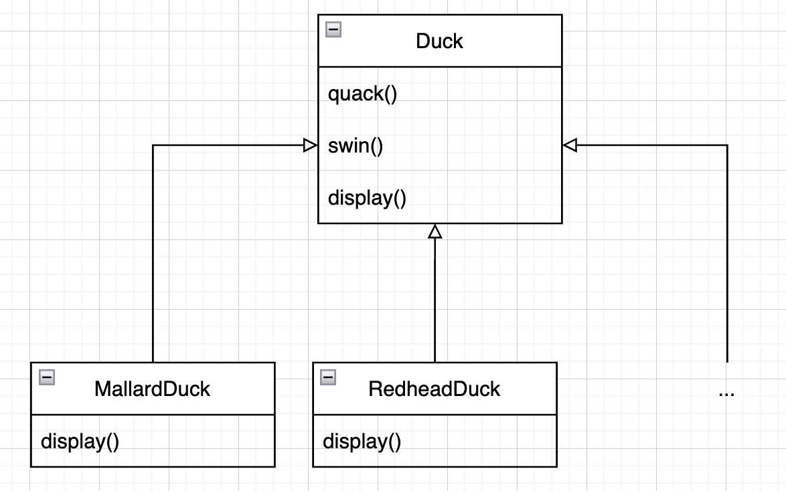
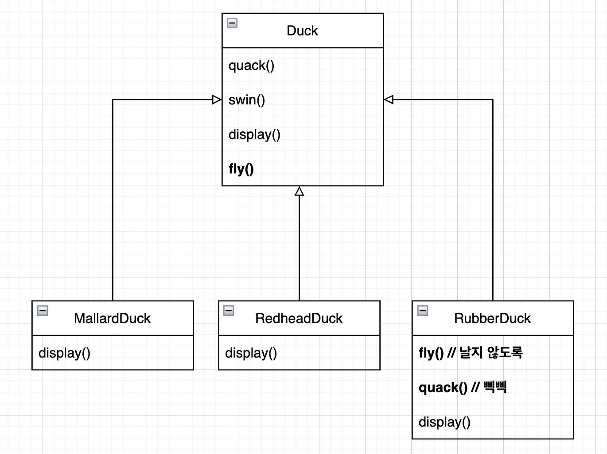
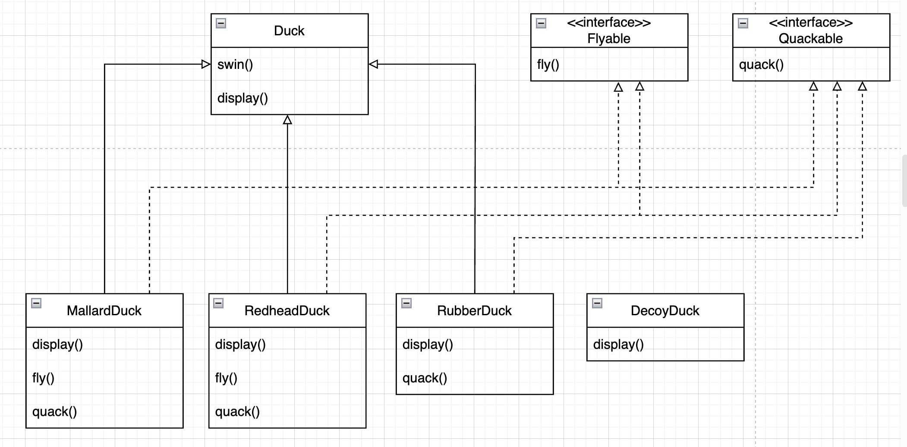
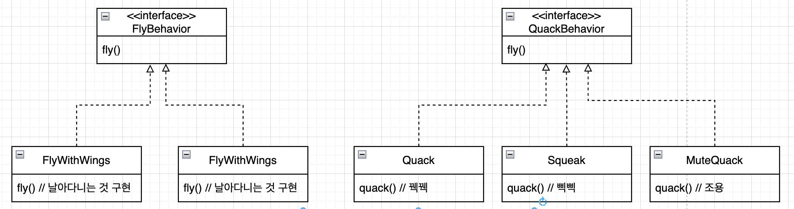
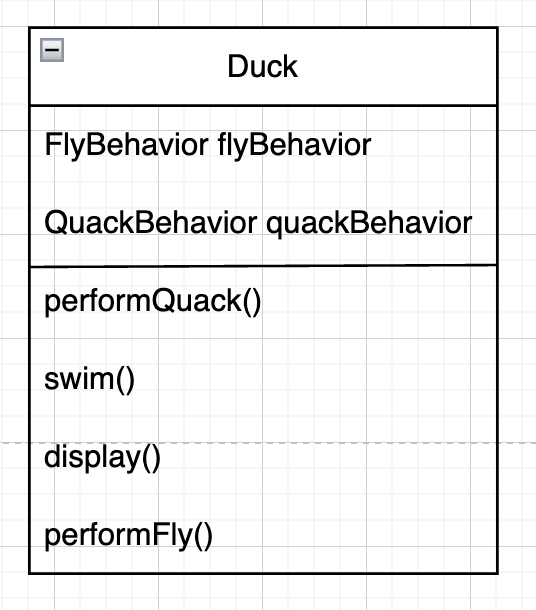
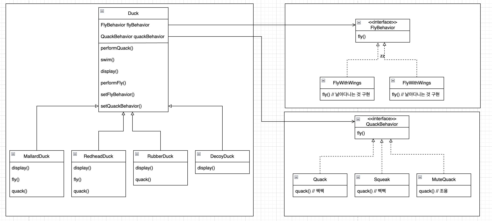

# 1. 디자인 패턴 소개

## 오리 시뮬레이션 게임, SimUduck

<p align="center">

## 날아다니는 기능을 추가 - 상속

<p align="center">

* 문제 발생: 고무 오리 인형이 날아다님
* 해결: 오버라이드로 해결
* 상속의 문제점
    * 서브믈래스에서 코드가 중복된다.
    * 실행시에 특징을 바꾸기 힘들다.
    * 모든 오리의 행동을 알기 힘들다
    * 코드를 변경했을 때, 다른 오리들에게 원치 않은 영향을 끼칠 수 있다.

## 그렇다면, 인터페이스는?

<p align="center">

* Flyable, Quackable 인터페이스 추가
    * 해당 기능이 있는 오리(Duck의 구상클래스)에게만 추가 가능
* 문제점: 코드 중복

## 첫번째 객체지향 원칙

> 애플리케이션에서 **달라지는 부분**을 찾아 내고 **달라지지 않는 부분**으로부터 분리 시킨다.

* 바뀌는 부분을 캡슐화하면, 나중에 바뀌지 않는 부분에는 영향을 미치지 않은 채로 그 부분만 확장할 수 있다.

## 바뀌는 부분을 분리해 내기, 첫번째 객체지향 원칙 적용

* 바뀌는 부분: fly(), quack()

## 바뀌는 부분(오리의 행동) 디자인

* 목표
    - 특정 형식의 나는 행동으로 오리를 초기화
    - 실행중에서도 행동(나는 행동, 꿱꿱거리는 행동)을 바꿀 수 있도록 디자인

## 두번째 객체지향 원칙

> 구현이 아닌 인터페이스에 맞춰서 프로그래밍 한다.

* 여기서 인터페이스란, 상위형식에 맞춰서 프로그래밍한다는 의미. 인터페이스가 될 수도, 추상클래스가 될 수도 있다.

## Duck의 행동 구현하기

<p align="center">

* 행동 재사용 가능
* 기존의 행동 클래스나 행동을 사용하는 클래스를 건드리지 않고도 새로운 행동 추가 가능

## Duck의 행동 통합하기

<p align="center">

```java
public abstract class Duck {
    protected FlyBehavior flyBehavior;
    protected QuackBehavior quackBehavior;

    public abstract void display();

    public void swim() {
        System.out.println("Every ducks can swim");
    }

    public void performFly() {
        flyBehavior.fly();
    }

    public void performQuack() {
        quackBehavior.quack();
    }
}
```

1. flyBehavior, quackBehavior라는 두개의 인스턴스 변수 처가
2. performQuack(), performFly()에서 인스턴스 변수를 통해 행동을 실행시킴

```java
public class MallardDuck extends Duck {

    public MallardDuck() {
        flyBehavior = new FlyWithWings();
        quackBehavior = new Quack();
    }

    public void display() {
        System.out.println("I'm a mallard duck");
    }
}
```

3. 생성자에서 quackBehavior, flyBehavior 초기화

## 동적으로 행동을 지정하는 방법

```java
public abstract class Duck {
    // ...
    public void setFlyBehavior(FlyBehavior flyBehavior) {
        this.flyBehavior = flyBehavior;
    }

    public void setQuackBehavior(QuackBehavior quackBehavior) {
        this.quackBehavior = quackBehavior;
    }
}
```

```java
public class ModelDuck extends Duck {
    public ModelDuck() {
        flyBehavior = new FlyNoway();
        quackBehavior = new Quack();
    }

    @Override
    public void display() {
        System.out.println("저는 모형오리입니다.");
    }
}

```

```java
public class FlyRocketPowered implements FlyBehavior {
    @Override
    public void fly() {
        System.out.println("로켓 추진으로 날아갑니다.");
    }
}
```

```java
public class StrategyTest {
    @Test
    void createModelDuck() {
        final var duck = new ModelDuck();

        duck.performFly();
        duck.setFlyBehavior(new FlyRocketPowered());
        duck.performFly();
    }
}
```

```text
저는 못날아요.
로켓 추진으로 날아갑니다.
```

## 캡슐화된 행동을 큰 그림으로 바라보기

<p align="center">

* 클래스 사이의 관계
    * A는 B이다. - 상속
    * A에는 B가 있다 - 구성(composition)
    * A가 B를 구현한다. - 인터페이스

## 세번쨰 객체지향 원칙

> 상속 보다는 구성을 활용한다.

* FlyBehavior와 QuackBehavior가 행동을 위임받는다.
* 두 클래스를 이런 식으로 합치는 것을 구성(compostion)이라고 한다.

## 스트레티지 패턴(Strategy Pattern)

> 알고리즘군을 정의하고, 각각을 캡슐화하여 교환해서 사용할 수 있도록 만든다.
> 스트래티지를 활용하면, 알고리즘을 사용하는 클라이언트와는 동립적으로 알고리즘을 변경할 수 있다.

## 객체지향의 기초

* 추상화
* 캡슐화
* 다형성
* 상속

